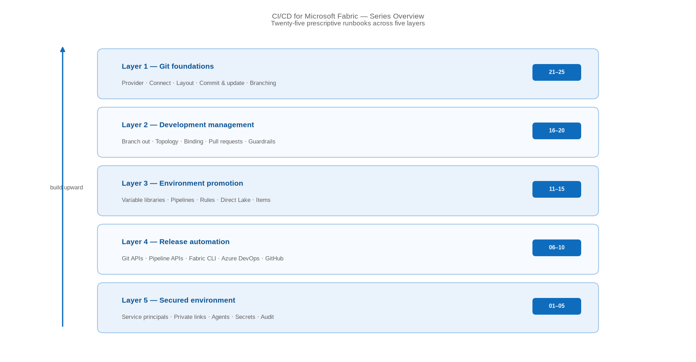

# CI/CD for Microsoft Fabric — Series Overview

> A prescriptive, 25-part how-to series covering Git, development management, and release automation — in both default and secured environments.

*CI/CD for Microsoft Fabric · 25-part how-to series · Level 300 · Start here*

Getting Fabric content from a developer's workspace into production reliably means making decisions at five different levels — and the guidance for each of them lives somewhere different. This series pulls all of it into one prescriptive set: **25 how-to entries**, organised into five layers, built from source control upward.

Every entry is a self-contained runbook — **prerequisites → numbered steps → validation → limitations → rollback** — with its own architecture diagram. Every entry also carries a **Secured environment — what changes** section, because the same process behaves differently once private links, service principals, and approval gates are in play.

This overview is the entry point. Find the layer you need, then work through its entries in order.

*Figure — The five layers of the series, built from source control upward.*

## How to read this series

- **Work from the bottom up.** The layers build on one another — source control first, then how developers work, then how content is parameterised for promotion, then how releases are automated, then how all of it is secured and proven.
- **Each entry stands alone.** Land on any single entry and act on it without reading the others — useful when you need one control in a hurry.
- **Default and secured are both covered.** The main body of each entry assumes a default Fabric environment. The **Secured environment** section states exactly what changes when the estate is locked down.
- **Every step is grounded in Microsoft Learn**, with the specific product documentation linked in each entry's References section.
- **Validate as you go.** Each entry ends with a validation step so you can prove the control works — and a rollback if you need to undo it.

## The two workflow options, and why the distinction matters

Fabric offers two ways to move content between environments, and one of the most consequential findings in this series is that they are **not equally available** in a locked-down estate:

|  | Git-based deployment | Deployment pipelines |
| --- | --- | --- |
| Promotion trigger | A merge into a release branch | A person or an API call in Fabric |
| Audit trail | Git history plus build runs | Deployment history |
| Parameterisation | `parameter.yml` and variable libraries | Deployment rules and variable libraries |
| **Workspaces denying public access** | **Supported** — the Git API works over private links | **Not supported** — pipelines cannot connect |

> **Note** — If your target state is a private-link estate, that last row should shape your architecture from the outset. Deployment pipelines and workspace-level private links are mutually exclusive today — entry 22 covers this in full.

## Layer 1 — Git foundations

| # | Entry | Focus |
| --- | --- | --- |
| 01 | **Choose Your Git Provider and Switch On Fabric Git Integration** | Azure DevOps vs GitHub; tenant settings; the delegation chain |
| 02 | **Connect a Workspace to a Repository, Branch, and Folder** | One workspace, one branch, one folder; initial sync direction |
| 03 | **Read the Fabric Repository Layout** | `.platform`, logical IDs, and where environment bindings live |
| 04 | **Commit, Update, and Resolve Conflicts Without Losing Work** | The two-direction sync loop and conflict resolution |
| 05 | **Choose a Branching Strategy That Fits Fabric Workspaces** | Feature, release, and hybrid models mapped to workspaces |

## Layer 2 — Development management

| # | Entry | Focus |
| --- | --- | --- |
| 06 | **Give Every Developer an Isolated Workspace with Branch Out** | Branch out, selective branching, and clean-up |
| 07 | **Design a Development, Test, and Production Workspace Topology** | Three stages, naming, access, and where data lives |
| 08 | **Know What Auto-Binds Across Workspaces — and What Does Not** | The binding table behind most failed deployments |
| 09 | **Gate Every Change with Pull Requests and Branch Policies** | Reviewers, build validation, and merge strategy |
| 10 | **Set the Permission Guardrails Around Fabric Development** | Paired workspace roles and repository permissions |

## Layer 3 — Environment promotion

| # | Entry | Focus |
| --- | --- | --- |
| 11 | **Centralise Environment Configuration with Variable Libraries** | Value sets per stage; the modern parameterisation default |
| 12 | **Build and Configure a Fabric Deployment Pipeline** | Stages, workspace assignment, compare, and deploy |
| 13 | **Apply Deployment Rules So Content Points at the Right Stage** | Data source and parameter rules on the target stage |
| 14 | **Rebind Direct Lake Semantic Models Across Stages** | The item type that does not auto-bind, and its two fixes |
| 15 | **Rebind Notebooks, Data Pipelines, and Shortcuts Across Stages** | Three item types, three behaviours, three remedies |

## Layer 4 — Release automation

| # | Entry | Focus |
| --- | --- | --- |
| 16 | **Automate Git Operations with the Fabric REST APIs** | Connect, initialize, status, commit, and update |
| 17 | **Automate Stage Promotion with the Deployment Pipelines API** | Discovery, Deploy Stage Content, and selective payloads |
| 18 | **Deploy from a Terminal with the Fabric CLI** | `fab` install, authentication, and `fab deploy` |
| 19 | **Build an Azure DevOps Release Pipeline for Fabric** | `parameter.yml`, `fabric-cicd`, environments, and approvals |
| 20 | **Build a GitHub Actions Workflow for Fabric** | The same process with OIDC instead of stored secrets |

## Layer 5 — Secured environment

| # | Entry | Focus |
| --- | --- | --- |
| 21 | **Run Fabric CI/CD as a Service Principal, Not a Person** | Identity types, tenant setting, and secretless credentials |
| 22 | **Operate Fabric CI/CD Behind Workspace-Level Private Links** | What still works, what stops, and the FQDN format |
| 23 | **Run Build Agents Inside Your Network** | Self-hosted agents, managed identity, and required egress |
| 24 | **Protect Deployment Secrets and Gate Production Releases** | Key Vault, approvals, and branch control |
| 25 | **Audit and Monitor Your Fabric CI/CD Process** | Four evidence sources and the drift check |

## Where to start

If you are setting up Fabric CI/CD from scratch, start at **Layer 1** and work up — source control is the control that makes every layer above it meaningful.

- **Nothing under source control yet?** Layer 1, in order. Entries 01 and 02 are the minimum viable state.
- **Developers overwriting each other?** Layer 2, starting at entry 06.
- **Deployments succeed but read the wrong data?** Entry 08 for the diagnosis, then entries 11, 13, 14, and 15 for the fixes.
- **Promotion still manual?** Layer 4, starting at entry 16 for the primitives or entry 19 for a complete pipeline.
- **Facing a private-link mandate or an audit?** Layer 5 — and read entry 22 before you restrict anything.

## A note on currency

> **Note** — Fabric CI/CD ships quickly. Every step here reflects the product and its documentation as of publication — including several dated changes already announced, such as the **December 1, 2026** Git integration permission change and the **February 12, 2026** deployment pipeline semantic model retirement. Verify current behaviour in your own tenant before standardising on it, particularly for capabilities that recently reached general availability.

## References

- [CI/CD in Microsoft Fabric — Microsoft Learn](https://learn.microsoft.com/en-us/fabric/cicd/cicd-overview)
- [CI/CD workflow options in Fabric — Microsoft Learn](https://learn.microsoft.com/en-us/fabric/cicd/manage-deployment)
- [Fabric CI/CD best practices — Microsoft Learn](https://learn.microsoft.com/en-us/fabric/cicd/best-practices-cicd)
- [Best practices for lifecycle management in Fabric — Microsoft Learn](https://learn.microsoft.com/en-us/fabric/fundamentals/understand-best-practices-fabric-cicd)
- [Introduction to Git integration — Microsoft Learn](https://learn.microsoft.com/en-us/fabric/cicd/git-integration/intro-to-git-integration)
- [Introduction to deployment pipelines — Microsoft Learn](https://learn.microsoft.com/en-us/fabric/cicd/deployment-pipelines/intro-to-deployment-pipelines)
- [Security considerations for Fabric CI/CD — Microsoft Learn](https://learn.microsoft.com/en-us/fabric/cicd/cicd-security)
