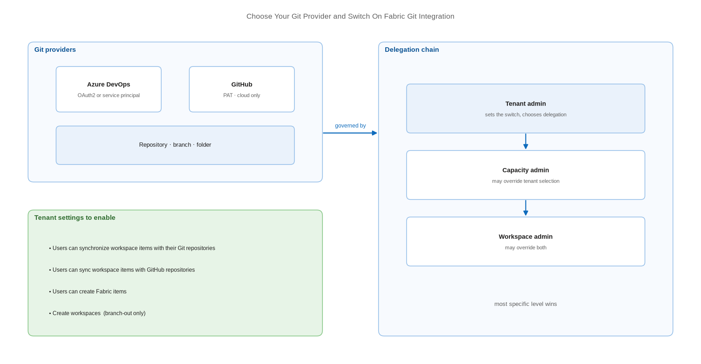

# Choose Your Git Provider and Switch On Fabric Git Integration

> Pick Azure DevOps or GitHub, then enable the exact tenant settings that make source control possible.

*Series: Git foundations · Layer: Foundations (1 of 5) · Audience: Fabric admins, platform engineers, and analytics developers · Level 300*

Everything else in this series depends on one decision and four switches. This entry covers choosing a Git provider that Fabric actually supports, enabling the tenant settings that permit workspace-to-Git synchronisation, and understanding the **tenant → capacity → workspace** delegation chain so the setting you flip is the one that takes effect.

## Scenario — when to use this

You are standing up source control for Fabric for the first time, or you have inherited a tenant where Git integration is switched off and nobody is sure why. Analytics content lives only in workspaces, there is no review history, and a mistaken overwrite in a shared workspace is unrecoverable.

Start here regardless of your eventual deployment mechanism. Both CI/CD workflow options in Fabric — Git-based release branches and deployment pipelines — assume a working Git connection underneath, so this switch-on is not optional groundwork you can defer.

For more detail on how the options fit together, see:

- [CI/CD in Microsoft Fabric — Microsoft Learn](https://learn.microsoft.com/en-us/fabric/cicd/cicd-overview)
- [CI/CD workflow options in Fabric — Microsoft Learn](https://learn.microsoft.com/en-us/fabric/cicd/manage-deployment)

## What you'll set up

- A supported Git provider — **Azure DevOps** or **GitHub** — reachable from your tenant.
- The tenant settings that permit workspace synchronisation for that provider.
- A delegation decision: whether capacity and workspace admins may override the tenant switch.
- The cross-geo and sensitivity-label export decisions, made deliberately rather than by default.

*Figure 1 — The Fabric Git integration control plane: provider choice on the left, the delegation chain that governs it on the right.*

## Prerequisites

- A **Fabric capacity**. Git integration requires capacity for the full set of Fabric items; Power BI-only SKUs support Power BI items only.
- You are a **Fabric administrator** to set tenant switches (capacity or workspace admins may suffice if delegation is already enabled).
- A Git provider account: an **Azure DevOps** organisation and project, or a **GitHub** cloud account.
- The Fabric master admin switch is on. Git integration switches are part of Fabric and only work when Fabric itself is enabled.

## Step 1 — Choose the provider

Fabric supports two providers today, and the differences are operational rather than cosmetic:

| Consideration | Azure DevOps | GitHub |
| --- | --- | --- |
| Tenant switch default | Enabled by default | **Disabled** by default |
| Authentication to the repo | OAuth2 or **service principal** | Personal access token (classic or fine-grained) |
| On-premises / self-hosted | Not applicable | Cloud only — GitHub Enterprise Server is not supported |
| Cross-geo export control | Enforced by the tenant switch | Switch **cannot be enforced** by Fabric |
| Commit size ceiling | 25 MB (service principal) / 125 MB (user SSO) | 50 MB combined per commit |

> **Note** — If your organisation already runs Azure Boards and Azure Pipelines, Azure DevOps is the lower-friction choice because it is the only provider where Fabric can authenticate to the repository as a **service principal** — which becomes essential once you automate. See entry 21.

## Step 2 — Enable the tenant settings

1. Open the **Fabric admin portal** → **Tenant settings**.
2. Enable **Users can synchronize workspace items with their Git repositories**. This is the Azure DevOps switch and it is enabled by default — confirm rather than assume.
3. For GitHub, additionally enable **Users can sync workspace items with GitHub repositories**. This one is **disabled by default**.
4. Enable **Users can create Fabric items** if teams will source-control Fabric (non-Power BI) items.
5. Enable **Create workspaces** only if you intend to use branch-out to a *new* workspace (entry 06).
6. Scope each switch with **The entire organization**, **Specific security groups**, or **Except specific security groups**.

## Step 3 — Decide the two export questions

1. **Users can export items to Git repositories in other geographical locations.** Turn this on only if your repo region differs from your capacity region and you accept metadata leaving the geo. Only item *metadata* is exported — item data and user information are not.
2. **Users can export workspace items with applied sensitivity labels to Git repositories.** Sensitivity labels are **not** carried into Git. Decide whether to block export of labelled items or accept that the label does not travel with the definition.

> **Note** — The cross-geo switch cannot be enforced for GitHub — Fabric has no mechanism to validate GitHub repository geography. If data residency is a hard requirement, that asymmetry should drive your provider choice.

## Step 4 — Set the delegation chain deliberately

Under **Delegate settings to other admins**, choose whether **Capacity admins can enable/disable** and **Workspace admins can enable/disable**. Precedence runs **tenant → capacity → workspace**, with the most specific level winning.

1. Leave delegation **off** when you need a single, centrally enforced answer for the whole tenant.
2. Turn delegation **on** when platform teams own their own capacities and you want them to self-serve.
3. A capacity admin overrides from the capacity's **Delegated tenant settings** page by selecting **Override tenant admin selection**.

> **Tip** — A regulated organisation — a bank, a hospital group, a public agency — typically leaves delegation off for the two export switches and on for the synchronisation switch. Residency stays central; day-to-day enablement is devolved.

## Secured environment — what changes

- Azure DevOps **is not supported** when **Enable IP Conditional Access policy validation** is enabled in Entra ID. Confirm this before committing to Azure DevOps in a Conditional Access-heavy tenant.
- Your Fabric authentication strength must be **at least as strong** as your Git provider's. If Git requires multifactor authentication, Fabric must require it too.
- GitHub Enterprise Server on a private network, with a custom domain, or behind an IP allow-list is **not supported** — even when publicly reachable.
- **Sovereign clouds are not supported** for Git integration.
- Plan for the change coming **December 1, 2026**: users without read-write permissions on workspace items will no longer be able to use Git integration.

## Validate

- Open any workspace → **Workspace settings**. A **Git integration** tab is present.
- The provider you enabled appears in the provider list; the one you did not enable does not.
- Sign in as a non-admin member of an in-scope security group and confirm the tab is visible to them too.

## Limitations & gotchas

- Git integration switches only work when the **Fabric master switch** is on. With Fabric disabled, Git works only for workspaces containing Power BI items.
- **My Workspace cannot be connected** to a Git provider at all.
- Workspaces with template apps installed cannot be connected to Git.
- A workspace can contain a maximum of **1,000 Fabric and Power BI items**, and this ceiling applies to everything managed through Git.
- Only a **workspace admin** can create or remove the Git connection, regardless of delegation settings.

## Rollback

1. Admin portal → **Tenant settings** → disable **Users can synchronize workspace items with their Git repositories** (and the GitHub equivalent).
2. Existing connections stop synchronising. Disconnect them per workspace: **Workspace settings** → **Git integration** → **Disconnect workspace**.

## References

- [Git integration tenant settings — Microsoft Learn](https://learn.microsoft.com/en-us/fabric/admin/git-integration-admin-settings)
- [Introduction to Git integration — Microsoft Learn](https://learn.microsoft.com/en-us/fabric/cicd/git-integration/intro-to-git-integration)
- [Get started with Git integration — Microsoft Learn](https://learn.microsoft.com/en-us/fabric/cicd/git-integration/git-get-started)
- [CI/CD in Microsoft Fabric — Microsoft Learn](https://learn.microsoft.com/en-us/fabric/cicd/cicd-overview)
- [CI/CD workflow options in Fabric — Microsoft Learn](https://learn.microsoft.com/en-us/fabric/cicd/manage-deployment)
