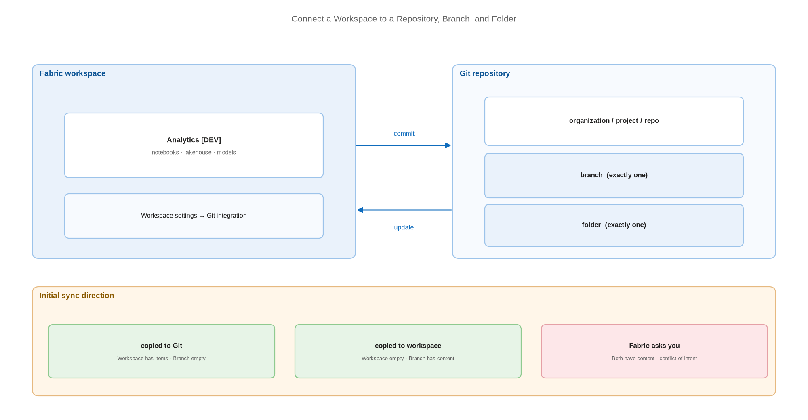

# Connect a Workspace to a Repository, Branch, and Folder

> Bind one workspace to exactly one branch and one folder — and control the direction of the first sync.

*Series: Git foundations · Layer: Foundations (2 of 5) · Audience: Fabric admins, platform engineers, and analytics developers · Level 300*

A Fabric workspace connects to **one repository, one branch, and one folder** at a time. That one-to-one constraint is the single most important fact about Fabric source control, and it shapes every topology decision later in this series. This entry makes the connection and gets the initial sync right.

## Scenario — when to use this

Tenant settings are on (entry 01) and you now need a workspace under source control. The workspace may already contain items, the repository may already contain content, or both — and the first sync must not destroy either.

Do this for your development workspace first. Test and production workspaces are connected later, to release branches, once you have chosen a branching strategy in entry 05.

For more detail on how this option works, see:

- [Get started with Git integration — Microsoft Learn](https://learn.microsoft.com/en-us/fabric/cicd/git-integration/git-get-started)
- [Introduction to Git integration — Microsoft Learn](https://learn.microsoft.com/en-us/fabric/cicd/git-integration/intro-to-git-integration)

## What you'll set up

- A workspace bound to a specific **organisation / project / repository / branch / folder**.
- A deliberate **initial sync direction** — workspace-to-Git or Git-to-workspace.
- Optionally, delegated branch switching for Contributors and Members.



*Figure 2 — One workspace binds to exactly one branch and one folder; the initial sync direction depends on which side already holds content.*

## Prerequisites

- You are a **workspace admin**. Only an admin can create the connection.
- The workspace is **not** My Workspace and has no template app installed.
- In Azure Repos you hold **Read = Allow** on the target repository, directory, and branch.
- For GitHub, a **classic** personal access token with the `repo` scope, or a **fine-grained** token with **Contents: Read and write**.
- If workspace and repository are in different geographies, the cross-geo export tenant switch is enabled (Azure DevOps only).

## Step 1 — Add the provider account

1. Open the workspace → **Workspace settings** → **Git integration**.
2. Select your Git provider — **Azure DevOps** or **GitHub**.
3. Select **Add account** and supply the connection details.

For **Azure DevOps**, supply a unique **Display name**, the repository URL, and an authentication method (**OAuth2** or **service principal**). The URL must take one of these forms:

```
https://dev.azure.com/{organization}/{project}/_git/{repository}
https://{organization}.visualstudio.com/{project}/_git/{repository}
```

For **GitHub**, supply a unique **Display name**, a **personal access token**, and optionally a **Repository URL**. Leaving the URL blank lets the account reach any repository you can access; supplying it pins the account to that one repository. The URL is mandatory for `ghe.com`.

> **Tip** — Pin the GitHub account to a repository URL. An unpinned account can connect a workspace to any repository the token holder can reach — a wide blast radius for a token that tends to outlive the person who created it.

## Step 2 — Select the branch and folder

1. Choose the **Organization**, **Project**, and **Git repository**.
2. Choose the **Branch** from the dropdown, or select **+ New Branch** to create one. You can connect to only one branch at a time.
3. Type a **Folder** name — an existing folder, or a new name to create one. Leave it blank to use the repository root. You can connect to only one folder at a time.
4. Select **Connect and sync**.

> **Tip** — Always name a folder rather than using the root. A folder gives you room to keep pipeline YAML, `parameter.yml`, and documentation beside the Fabric item definitions without them being confused for workspace content.

## Step 3 — Control the initial sync direction

What happens on **Connect and sync** depends on which side holds content:

| Workspace | Git branch | Result |
| --- | --- | --- |
| Has items | Empty | Workspace content is copied **to Git**. |
| Empty | Has content | Git content is copied **to the workspace**. |
| Has items | Has content | Fabric **asks you** which direction to sync. |

> **Note** — The third row is the dangerous one. Choosing the wrong direction overwrites live work. Before connecting a populated workspace to a populated branch, decide which side is authoritative and — where the content matters — take a copy first.

## Step 4 — (Optional) Delegate branch switching

By default, **Switch branch** and **Checkout to new branch** require the workspace **Admin** role. To let developers self-serve:

1. In **Workspace settings**, enable **Allow users with at least Contributor role to change Git branch**.
2. Contributors and Members with write access to **all** items in the workspace can then switch and create branches under their own identity.

This is a per-workspace setting with no tenant-level equivalent, it requires an active Git connection, and it does **not** change who may connect or disconnect the workspace — those remain admin-only.

## Secured environment — what changes

- Authenticate Azure DevOps with a **service principal** rather than OAuth2 so the connection does not depend on an individual's account surviving a role change. See entry 21.
- The service principal path caps commits at **25 MB** versus 125 MB for user SSO — size your item folders accordingly.
- If the workspace will later sit behind workspace-level private links, connect it to Git **before** restricting inbound access, and read entry 22 first — several item types block private-link enablement outright.
- Prefer **fine-grained** GitHub tokens scoped to one repository with **Contents: Read and write**, and put them on a rotation schedule.

## Validate

- The **Source control** panel opens in the workspace and shows a **Git status** for each item.
- The repository contains a folder per item, each with a `.platform` file (entry 03).
- Make a trivial change to an item; the Source control panel reports it as **Uncommitted**.
- As a Contributor, confirm branch switching is available only if you enabled the delegation setting.

## Limitations & gotchas

- One workspace ↔ one branch ↔ one folder. There is no partial or multi-branch binding.
- You can sync in only **one direction at a time** — you cannot commit and update simultaneously.
- **Viewers see nothing.** A Viewer cannot perform Git actions or even see Git information in the workspace.
- Maximum branch name length is **244 characters**; maximum full file path is **250 characters**; maximum file size is **25 MB**. Folder structure is preserved to **10 levels** deep.
- Duplicate item names are rejected. Even where Fabric would otherwise allow a duplicate name, commit, update, and undo will fail.
- B2B (guest) scenarios are not supported.

## Rollback

1. **Workspace settings** → **Git integration** → **Disconnect workspace** → **Disconnect** to confirm.
2. Disconnecting leaves both the workspace items and the Git content in place; it removes only the link.
3. If the workspace has related branched workspaces, disconnecting removes **all** of those relationships too (entry 06).

## References

- [Get started with Git integration — Microsoft Learn](https://learn.microsoft.com/en-us/fabric/cicd/git-integration/git-get-started)
- [Introduction to Git integration — Microsoft Learn](https://learn.microsoft.com/en-us/fabric/cicd/git-integration/intro-to-git-integration)
- [The Git integration process — Microsoft Learn](https://learn.microsoft.com/en-us/fabric/cicd/git-integration/git-integration-process)
- [Git integration tenant settings — Microsoft Learn](https://learn.microsoft.com/en-us/fabric/admin/git-integration-admin-settings)
