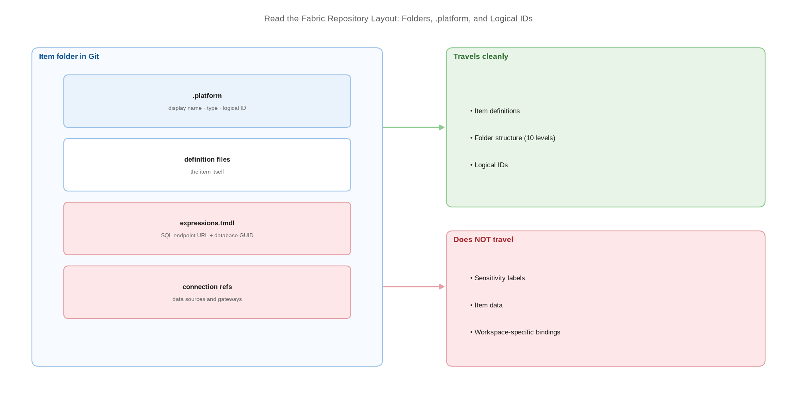

# Read the Fabric Repository Layout: Folders, .platform, and Logical IDs

> Understand what Fabric actually writes to Git so you can review diffs and predict deployments.

*Series: Git foundations · Layer: Foundations (3 of 5) · Audience: Fabric admins, platform engineers, and analytics developers · Level 300*

Fabric serialises each item into a folder of plain-text files. Once you can read that layout you can review a pull request meaningfully, spot the connection strings that will break on promotion, and stop treating deployment as a black box. This entry decodes the structure.

## Scenario — when to use this

Your workspace is connected and files are appearing in the repository, but the diffs are opaque. Reviewers are approving changes they cannot read, and nobody can answer the question that matters most at promotion time: *which files in here point at the development environment?*

Read this before writing branch policies (entry 09) or any automation (entries 16-20). Every parameterisation decision later in the series is really a decision about a specific file in this layout.

For more detail on how this works, see:

- [Fabric item source code format — Microsoft Learn](https://learn.microsoft.com/en-us/fabric/cicd/git-integration/source-code-format)
- [Understand dependency binding in cross-workspace deployment — Microsoft Learn](https://learn.microsoft.com/en-us/fabric/cicd/cross-workspace-dependency-binding)

## What you'll set up

- A working understanding of the **item folder** convention and the `.platform` file.
- The distinction between an item **logical ID** and its display name.
- A `.gitignore` that keeps large and transient files out of commits.
- A review habit that targets the files which carry environment-specific bindings.



*Figure 3 — Anatomy of a Fabric item folder in Git: the .platform descriptor, the definition files, and the bindings that do not travel cleanly between workspaces.*

## Prerequisites

- A workspace connected to a repository and synchronised at least once (entry 02).
- Read access to the repository through your Git provider's web UI or a local clone.

## Step 1 — Map the folder structure

1. Open the connected folder in your repository.
2. Confirm each Fabric item appears as its **own folder**, named for the item's display name and type.
3. Confirm that workspace **subfolders** are mirrored in the repository. The workspace structure, including subfolders, is preserved in Git.
4. Open one item folder and locate the hidden **`.platform`** file.

> **Note** — Some older documentation states that Git does not support workspace folders. That statement is stale — current Git integration mirrors the workspace folder structure, including subfolders, in the repository.

## Step 2 — Read the .platform file

Every item folder carries a `.platform` file holding the item metadata Fabric needs to reconstruct the item: its display name, type, and **logical ID**. The logical ID is the stable identifier that survives across workspaces — it is how Fabric recognises "the same item" in dev, test, and production.

> **Note** — Fabric renames an item's Git folder to the logical ID and type when the display name exceeds 256 characters, ends with a period or a space, or contains forbidden characters. If folders in your repository look like GUIDs, that renaming rule is why.

## Step 3 — Locate the environment-specific bindings

These are the files a reviewer must actually read, because they carry values that are correct in one workspace and wrong in the next:

| Item type | Where the binding lives | Auto-binds on deploy? |
| --- | --- | --- |
| Direct Lake semantic model | `expressions.tmdl` — SQL endpoint URL and database GUID | **No** |
| Warehouse reference | Workspace-specific SQL analytics endpoint URL | **No** |
| Notebook | Default lakehouse and attached environment metadata | Yes, same-workspace dependencies |
| Data pipeline / connections | Connection and gateway references | **No** |
| Semantic model (chained/composite) | Connection strings by name | Partial |

> **Tip** — Make a pull-request rule of it: any diff that touches `expressions.tmdl` or a connection reference is an environment-binding change and needs a second reviewer. Entries 11 and 14 remove the problem at the source.

## Step 4 — Add a .gitignore

Commits are size-capped — **50 MB** combined for GitHub, **25 MB** per file — so keep generated and transient content out of the repository:

```
# Fabric repository .gitignore

# Notebook execution artefacts
**/.ipynb_checkpoints/

# Local tooling and secrets — never commit these
.env
*.pfx
*.pem
local.settings.json

# OS noise
.DS_Store
Thumbs.db
```

## Secured environment — what changes

- **Sensitivity labels are not exported to Git.** A labelled item loses its label in the repository, and your tenant may block the export entirely. Treat the repository as an unlabelled surface and secure it with repository permissions.
- The repository holds item **definitions**, not item **data** — but connection strings, endpoint URLs, and workspace GUIDs are definitions. Treat the repository as environment-sensitive and restrict read access accordingly.
- Never commit credentials. Secrets belong in Azure Key Vault or your provider's secret store (entry 24), referenced at deploy time.
- Enable secret scanning and push protection on the repository so a committed token is blocked rather than discovered later.

## Validate

- Every item in the workspace has a matching folder in the repository.
- Each folder contains a `.platform` file with a logical ID.
- Opening a Direct Lake semantic model's `expressions.tmdl` shows a workspace-specific endpoint URL and database GUID.
- Committing a large binary is rejected or warned on, confirming the `.gitignore` and size limits behave as expected.

## Limitations & gotchas

- Directory names cannot begin or end with a space or tab, and cannot contain `" / : < > \ * ? |`. Item folders cannot contain `" : < > \ * ? |`. Renaming a folder to include one breaks sync.
- During **Commit to Git**, Fabric deletes files inside an item folder that are not part of the item definition. Unrelated files outside item folders are left alone — keep your YAML and docs outside the item folders.
- Unsupported item types in the folder are silently ignored rather than reported.
- Downloading a report or semantic model as `.pbix` after deploying with Git integration is **not recommended** — results are unreliable. Use Power BI Desktop.
- Git operations such as **Undo** or **Update from Git** re-create deleted items with a **new item ID**, while restoring from the recycle bin preserves the original. Doing both produces duplicate items with different identities and can break Git integration. Delete the Git-re-created copy to resolve.

## Rollback

1. The layout is produced by Fabric and is not directly editable — there is nothing to roll back structurally.
2. To discard local layout experiments, use **Undo** in the Source control panel to restore items to the last committed state.
3. To remove a `.gitignore` rule, delete the line and commit; previously ignored files are picked up on the next commit.

## References

- [Fabric item source code format — Microsoft Learn](https://learn.microsoft.com/en-us/fabric/cicd/git-integration/source-code-format)
- [Understand dependency binding in cross-workspace deployment — Microsoft Learn](https://learn.microsoft.com/en-us/fabric/cicd/cross-workspace-dependency-binding)
- [The Git integration process — Microsoft Learn](https://learn.microsoft.com/en-us/fabric/cicd/git-integration/git-integration-process)
- [Introduction to Git integration — Microsoft Learn](https://learn.microsoft.com/en-us/fabric/cicd/git-integration/intro-to-git-integration)
