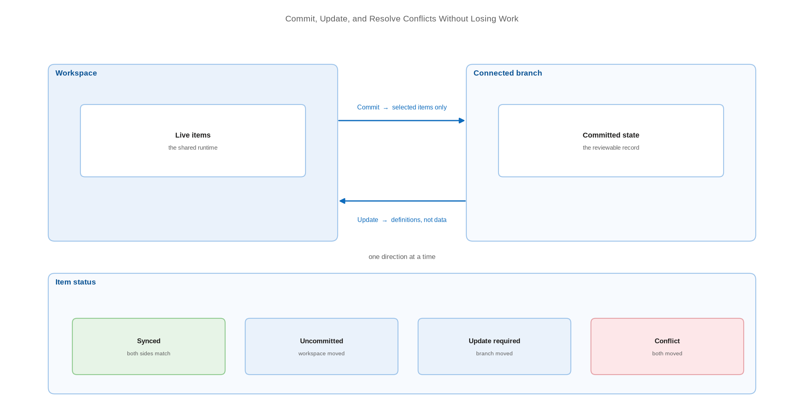

# Commit, Update, and Resolve Conflicts Without Losing Work

> Run the two-direction sync safely, and know your options when both sides changed.

*Series: Git foundations · Layer: Foundations (4 of 5) · Audience: Fabric admins, platform engineers, and analytics developers · Level 300*

Fabric source control is a two-button loop: **Commit** pushes workspace changes to Git, **Update** pulls Git changes into the workspace. This entry covers running that loop safely, committing selectively, and resolving the conflict state that appears when both sides moved.

## Scenario — when to use this

Multiple people work in the same connected workspace, or one person works in both the workspace and a local clone. Changes are diverging, the Source control panel shows a conflict, and the team is unsure which action is safe.

This is the daily operating procedure for every connected workspace. Read it before you scale to multiple developers in entry 06, because the isolation pattern there exists precisely to make conflicts rare.

For more detail on how this works, see:

- [The Git integration process — Microsoft Learn](https://learn.microsoft.com/en-us/fabric/cicd/git-integration/git-integration-process)
- [Resolve Git conflicts — Microsoft Learn](https://learn.microsoft.com/en-us/fabric/cicd/git-integration/conflict-resolution)

## What you'll set up

- A reliable **commit / update** loop with meaningful commit messages.
- Selective commits so unrelated work-in-progress stays out of a release.
- A conflict-resolution procedure the whole team follows.

*Figure 4 — The two-direction sync loop, the four item statuses, and the point at which a conflict is raised.*

## Prerequisites

- A connected workspace (entry 02).
- Workspace **Contributor** or higher with **write** access to all items you intend to sync.
- In Azure Repos, **Read = Allow** to update and **Contribute = Allow** to commit; the branch policy must permit direct commits from Fabric.

## Step 1 — Read the item status

1. Open the workspace → **Source control**.
2. Review each item's status. Items differ from Git (**Uncommitted**), Git differs from the workspace (**Update required**), both changed (**Conflict**), or the two sides match (**Synced**).
3. Note the counters on the Source control icon — they summarise pending work in both directions.

## Step 2 — Commit workspace changes to Git

1. In **Source control**, open the **Changes** tab.
2. Select the items to commit. You do **not** have to commit everything — clear the checkboxes on work you are not ready to publish.
3. Enter a commit message that names the change and its reason.
4. Select **Commit**. Only the selected items are written to the connected branch and folder.

> **Tip** — Selective commit is what makes a shared development workspace survivable. Combined with the branch-out pattern in entry 06, it lets one person ship a fix while a colleague's half-finished notebook stays out of the branch.

## Step 3 — Update the workspace from Git

1. Open the **Updates** tab in the Source control panel.
2. Review the incoming items.
3. Select **Update all** to bring the workspace in line with the branch.

> **Note** — Update replaces workspace item **definitions** with those from Git. It does not restore item **data** — a lakehouse table is not rolled back by an update. Definition and data have separate lifecycles throughout Fabric CI/CD.

## Step 4 — Resolve a conflict

A conflict is raised when the same item changed in both the workspace and the branch since the last sync. Fabric offers these routes:

1. **Accept the workspace version** — keep what is in Fabric and overwrite the branch on the next commit.
2. **Accept the Git version** — discard the workspace change and take the branch definition.
3. **Resolve in Git** — resolve the conflict in the repository using your provider's tooling, then update the workspace. Conflict resolution is only partially handled inside Fabric.
4. **Undo** the workspace change to return the item to its last committed state and clear the conflict.

> **Note** — Fabric's conflict-resolution documentation introduces the options as "three ways" and then lists four. Treat the enumerated list as authoritative, not the count.

## Secured environment — what changes

- Where branch policies block direct commits to a protected branch, Fabric cannot commit to it. Point connected workspaces at feature or release branches and merge through pull requests (entry 09).
- Commit size ceilings bite harder with a service principal: **25 MB** for Azure DevOps via service principal, **125 MB** via user SSO, **50 MB** combined for GitHub. Split large changes into several commits.
- From **December 1, 2026**, users without read-write permissions on workspace items cannot use Git integration — audit who currently relies on read-only access to commit.
- Sensitivity labels are not included in exports and may be blocked entirely by tenant policy, which can make a labelled item impossible to commit.

## Validate

- Change one item, commit only that item, and confirm the repository shows exactly one item folder modified.
- Change the same item from the Git side, then update the workspace and confirm the change lands.
- Deliberately create a conflict on a disposable item, resolve it, and confirm the status returns to **Synced**.
- Confirm the commit message appears in the branch history with the expected author identity.

## Limitations & gotchas

- You can sync in only **one direction at a time**. Commit and update cannot run simultaneously.
- Conflict resolution is only **partially** performed in Fabric — some cases must be settled in the Git provider.
- Duplicate item names cause commit, update, and undo to fail even where Fabric otherwise permits the duplicate name.
- Items unsupported by Git integration are ignored and will not be protected by any of this.
- Semantic models connected to Analysis Services are not supported.
- A workspace identity committed to Git can only be updated back into a workspace connected to **the same identity** — this also affects branch-out.

## Rollback

1. To discard workspace changes: **Source control** → select the items → **Undo**. Items return to their last committed state.
2. To roll the branch back: revert the commit in your Git provider, then **Update all** in the workspace.
3. Remember that neither route restores item **data** — only definitions.

## References

- [The Git integration process — Microsoft Learn](https://learn.microsoft.com/en-us/fabric/cicd/git-integration/git-integration-process)
- [Resolve Git conflicts — Microsoft Learn](https://learn.microsoft.com/en-us/fabric/cicd/git-integration/conflict-resolution)
- [Select items to commit or update (partial update) — Microsoft Learn](https://learn.microsoft.com/en-us/fabric/cicd/git-integration/partial-update)
- [Git integration — considerations and limitations — Microsoft Learn](https://learn.microsoft.com/en-us/fabric/cicd/git-integration/git-integration-process#considerations-and-limitations)
- [Troubleshoot CI/CD in Fabric — Microsoft Learn](https://learn.microsoft.com/en-us/fabric/cicd/troubleshoot-cicd)
