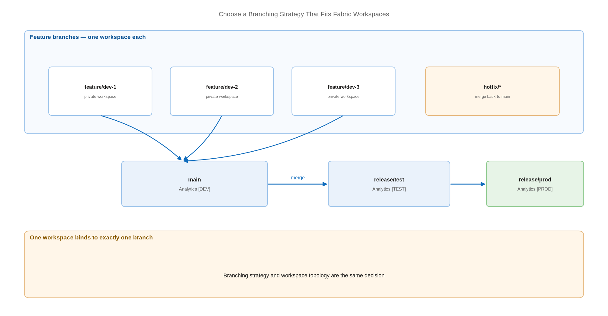

# Choose a Branching Strategy That Fits Fabric Workspaces

> Map branches to workspaces deliberately — the one-branch-per-workspace rule decides your whole topology.

*Series: Git foundations · Layer: Foundations (5 of 5) · Audience: Fabric admins, platform engineers, and analytics developers · Level 300*

A Fabric workspace is a **shared runtime environment**, and each workspace connects to exactly one branch. Those two facts together mean your branching strategy and your workspace topology are the same decision. This entry helps you make it once, correctly.

## Scenario — when to use this

You have Git working on a single workspace and now need to support a team. Developers are overwriting one another because any change made directly in a shared workspace affects every other user of that workspace immediately.

Settle this before creating more workspaces. Retrofitting a branching model onto an established sprawl of workspaces is materially harder than choosing one now.

For more detail on the available approaches, see:

- [Development process in Microsoft Fabric — Microsoft Learn](https://learn.microsoft.com/en-us/fabric/cicd/git-integration/manage-branches)
- [CI/CD workflow options in Fabric — Microsoft Learn](https://learn.microsoft.com/en-us/fabric/cicd/manage-deployment)
- [Best practices for lifecycle management in Fabric — Microsoft Learn](https://learn.microsoft.com/en-us/fabric/fundamentals/understand-best-practices-fabric-cicd)

## What you'll set up

- A chosen branching model — **feature-branch**, **release-branch**, or a hybrid.
- A branch naming convention that maps predictably to workspaces.
- A documented promotion path from a developer's branch to production.



*Figure 5 — Feature branches flow through a shared main branch into release branches, each release branch bound to its own environment workspace.*

## Prerequisites

- Git integration enabled and at least one workspace connected (entries 01-02).
- Agreement on who may create workspaces — branch-out to a new workspace requires the **Create workspaces** tenant switch.
- Available capacity for the workspaces your model implies.

## Step 1 — Accept the constraint that drives everything

The Fabric workspace is a shared runtime environment for all its items, and each workspace can be connected to a single branch. Any change made directly in the workspace affects all other workspace users immediately. Fabric's documented guidance follows from this: developers should work in a **separate runtime environment** — a different workspace.

There are two documented ways to give a developer that protected space:

- **Develop using a branched workspace** — each developer gets their own workspace connected to their own branch (entry 06).
- **Develop using client tools** — Power BI Desktop for reports and semantic models, VS Code for notebooks.

## Step 2 — Pick the model

| Model | How it maps to Fabric | Best when |
| --- | --- | --- |
| **Feature branch** | Each developer branches out to their own workspace; merges to `main` via pull request. | Several developers change the same items; review is mandatory. |
| **Release branch** | `main` for development; long-lived `release/*` branches bound to test and production workspaces. | You need a stable, auditable snapshot per environment. |
| **Hybrid** | Feature branches into `main`, then `main` into `release/*` per environment. | Most regulated organisations — review at the front, control at the back. |

> **Tip** — The hybrid model is the sensible default for a team of more than three. A public-sector analytics group, for example, gets peer review at merge time and a frozen `release/prod` branch that auditors can point to months later.

## Step 3 — Fix a naming convention

Branch names become workspace names, so pick a scheme that survives contact with a browser tab list:

```
main                     -> Analytics [DEV]
release/test             -> Analytics [TEST]
release/prod             -> Analytics [PROD]
feature/<initials>-<topic>  -> Analytics [DEV] <initials> <topic>
hotfix/<ticket-id>          -> Analytics [HOTFIX] <ticket-id>
```

> **Note** — Maximum branch name length is **244 characters** and maximum full file path is **250 characters**. Deep feature-branch names plus deep item folder names can collide with the path limit before the branch limit.

## Step 4 — Decide how production gets its content

Fabric offers two documented promotion mechanisms, and your branching model should name which one you use:

- **Git-based deployment** — each environment workspace is connected to its own branch; promotion is a Git merge followed by an update. Your Git history is the audit trail.
- **Deployment-pipeline deployment** — a development workspace is Git-connected and content is promoted stage-to-stage by the pipeline. Git covers development; the pipeline covers promotion.

> **Note** — These are not mutually exclusive, but mixing them without a rule produces content that arrives in production by two different routes. Pick the primary mechanism per solution and write it down. Entries 12-15 cover deployment pipelines; entries 16-20 cover Git-based automation.

## Secured environment — what changes

- Workspaces that deny public inbound access **cannot be used in deployment pipelines** — configuring inbound restriction is blocked for any workspace assigned to a pipeline. In a private-link estate, the **Git-based** model is generally the viable one. See entry 22.
- Protect `main` and every `release/*` branch with policies requiring pull requests and reviewers (entry 09). Fabric commits directly to its connected branch, so protected branches must not be the ones workspaces write to.
- Long-lived release branches give auditors an immutable, dated snapshot of exactly what ran in production — worth the overhead in regulated settings.
- Keep hotfix branches short-lived and always merge them back to `main`, or the next release silently reverts the fix.

## Validate

- Every environment workspace shows the expected branch in **Workspace settings** → **Git integration**.
- A test feature branch can be created, branched out to a workspace, merged, and deleted end to end.
- Branch policies block a direct push to `main`.
- The promotion path is documented and a team member who did not design it can follow it unaided.

## Limitations & gotchas

- One workspace connects to one branch. Multi-branch workspaces do not exist.
- Each workspace connected to a branch consumes capacity — cost scales with the number of parallel developers.
- A workspace holds at most **1,000 items**; if a branch exceeds that, syncing it to a workspace fails.
- Switching branches deletes workspace items that exist in the old branch but not the new one, and you cannot switch with uncommitted changes pending.
- Sovereign clouds and Git submodules are not supported.

## Rollback

1. To abandon a model, disconnect the affected workspaces: **Workspace settings** → **Git integration** → **Disconnect workspace**.
2. Delete unused branches in the Git provider once no workspace references them.
3. Reconnect each workspace to the branch the new model specifies, choosing the sync direction deliberately (entry 02).

## References

- [Development process in Microsoft Fabric — Microsoft Learn](https://learn.microsoft.com/en-us/fabric/cicd/git-integration/manage-branches)
- [CI/CD workflow options in Fabric — Microsoft Learn](https://learn.microsoft.com/en-us/fabric/cicd/manage-deployment)
- [Best practices for lifecycle management in Fabric — Microsoft Learn](https://learn.microsoft.com/en-us/fabric/fundamentals/understand-best-practices-fabric-cicd)
- [Fabric CI/CD best practices — Microsoft Learn](https://learn.microsoft.com/en-us/fabric/cicd/best-practices-cicd)
- [Development process using the Branch-Out experience — Microsoft Learn](https://learn.microsoft.com/en-us/fabric/cicd/git-integration/branched-workspace)
