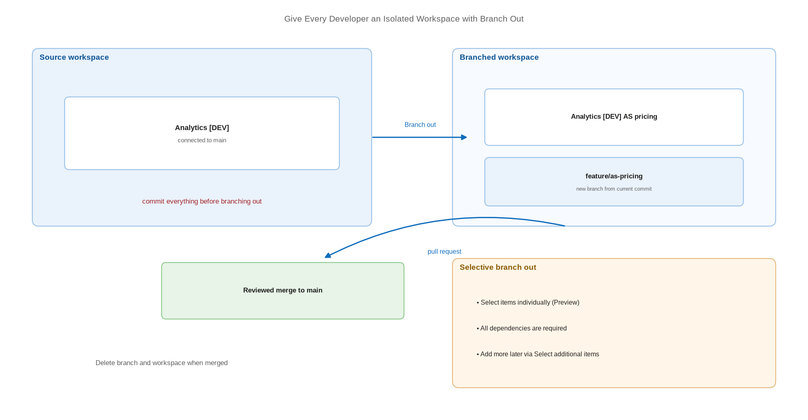

# Give Every Developer an Isolated Workspace with Branch Out

> Create a private branch and workspace in one action, so nobody develops on top of anyone else.

*Series: Development management · Layer: Isolation (1 of 5) · Audience: Fabric admins, platform engineers, and analytics developers · Level 300*

**Branch out to another workspace** creates a new Git branch from the current commit and attaches a workspace to it in a single action. It is Fabric's answer to the shared-runtime problem: instead of coordinating access to one workspace, each developer gets their own.

## Scenario — when to use this

Two or more people need to change items in the same solution at the same time. In a shared workspace their changes collide immediately, because a workspace is a shared runtime and every edit is live for every other user of that workspace.

Use branch-out whenever development is concurrent. If only one person ever touches a solution, a single connected workspace is adequate and cheaper — but that situation rarely lasts.

For more detail on how this works, see:

- [Development process using the Branch-Out experience — Microsoft Learn](https://learn.microsoft.com/en-us/fabric/cicd/git-integration/branched-workspace)
- [Development process in Microsoft Fabric — Microsoft Learn](https://learn.microsoft.com/en-us/fabric/cicd/git-integration/manage-branches)

## What you'll set up

- A per-developer branch created from the source workspace's current branch.
- A workspace linked to that branch — new, or an existing one switched over.
- Optionally, a **selective branch** containing only the items a developer needs.
- A clean-up routine so abandoned branches and workspaces do not accumulate.

*Figure 6 — Branch out clones the current branch and binds a private workspace to it; work merges back to the source branch through a pull request.*

## Prerequisites

- A Git-connected source workspace (entry 02) with **all wanted work committed**.
- Workspace **Admin**, **Member**, or **Contributor** on the source workspace.
- In Azure Repos, **Read = Allow** and **Create branch = Allow**.
- Available **capacity** for the new workspace.
- The **Create workspaces** tenant switch, if branching out to a new workspace.

> **Note** — Commit everything you want to keep **before** branching out. Items not saved to Git can be lost in the operation, and when branching out to an *existing* workspace some items may be deleted outright.

## Step 1 — Branch out

1. Open the source workspace → **Source control** → the **Branches** tab.
2. Select **Branch out to another workspace**.
3. Choose whether to create a **new workspace** or branch out into an **existing** one.
4. Enter the new branch name and workspace name, or pick the existing workspace from the dropdown.
5. Select **Branch out**.

## Step 2 — (Optional) Branch out selectively

By default the target workspace receives **all** items from the source branch. To take a subset:

1. During setup, tick **Select items individually (Preview)**.
2. Select **Branch out**, then choose the items you want.
3. Use **Select related items** to pull in dependencies — when branching selectively, all of an item's dependencies are required.
4. Select **Create branch**.

You can confirm you are in a selective branch from the icon in the lower-left status bar, which reads **selective branch**.

> **Tip** — Selective branching keeps a developer's workspace small and their capacity consumption modest. A retail analytics team, for example, can branch out only the pricing notebooks and their lakehouse rather than the entire 300-item estate.

## Step 3 — Add items to a selective branch later

1. In the branched workspace, select **Source control**.
2. On the right, select the **branch out** symbol.
3. From the dropdown, select **Select additional items**.
4. Choose the items and select **Add** — they appear as pending updates in the Source control pane.
5. Select **Update all**.

## Step 4 — Merge back and clean up

1. Commit the finished work from the branched workspace to its branch (entry 04).
2. Raise a pull request from the developer branch into the shared branch and have it reviewed (entry 09).
3. After the merge, **Update all** in the source workspace to bring the change down.
4. Delete the developer branch, then delete or reassign the branched workspace to release capacity.

## Secured environment — what changes

- An item that uses a **workspace identity** can only be updated back into a workspace connected to the **same identity**. This directly restricts branch-out for items bound to a workspace identity — plan identity placement before you scale the pattern.
- Every branched workspace is a real workspace with real access. Grant workspace roles through **security groups**, not individuals, so a developer leaving does not strand a workspace.
- Branched workspaces inherit none of the source workspace's network settings. If the source denies public inbound access, the branch target does not automatically do the same — configure it explicitly (entry 22).
- Set a maximum branch lifetime. Long-lived developer workspaces drift from the shared branch and quietly become a second source of truth.

## Validate

- The new workspace appears and **Workspace settings** → **Git integration** shows the new branch.
- The expected items are present — all of them, or exactly the selected subset plus dependencies.
- A change in the branched workspace commits to the developer branch and does **not** appear in the source workspace.
- The source workspace still shows its own branch and is unaffected.

## Limitations & gotchas

- Only **Git-supported item types** appear in the new workspace. Everything else is silently absent.
- Branch-out does **not** copy settings from the original branch — the new branch starts with defaults.
- The related-branches list shows only branches and workspaces you have permission to view, so the topology can look smaller than it is.
- Disconnecting a branched workspace from Git also removes its relationship to the source workspace; disconnecting the *source* removes **all** branched relationships; deleting the source workspace turns every branched workspace into a regular workspace.
- Branching into an existing workspace requires that workspace to support Git, have capacity, contain no template apps, and have **no related branched workspaces** of its own.
- You cannot **switch branches** with uncommitted changes pending, and switching deletes items present in the old branch but not the new one.

## Rollback

1. Abandon the work: delete the branched workspace, then delete the branch in the Git provider.
2. To keep the workspace but detach it: **Workspace settings** → **Git integration** → **Disconnect workspace**. The relationship to the source workspace is removed with it.
3. If you branched into an existing workspace and lost items, restore them from the source branch by switching back and running **Update all**.

## References

- [Development process using the Branch-Out experience — Microsoft Learn](https://learn.microsoft.com/en-us/fabric/cicd/git-integration/branched-workspace)
- [Development process in Microsoft Fabric — Microsoft Learn](https://learn.microsoft.com/en-us/fabric/cicd/git-integration/manage-branches)
- [Select items to commit or update (partial update) — Microsoft Learn](https://learn.microsoft.com/en-us/fabric/cicd/git-integration/partial-update)
- [CI/CD workflow options in Fabric — Microsoft Learn](https://learn.microsoft.com/en-us/fabric/cicd/manage-deployment)
- [Get started with Git integration — Microsoft Learn](https://learn.microsoft.com/en-us/fabric/cicd/git-integration/git-get-started)
