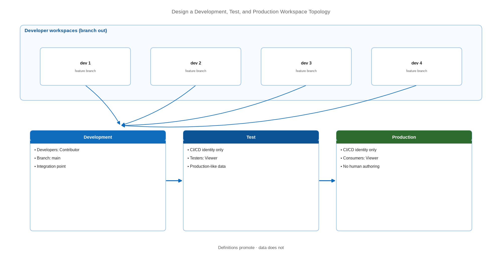

# Design a Development, Test, and Production Workspace Topology

> Lay out environments so promotion is predictable and no workspace serves two masters.

*Series: Development management · Layer: Isolation (2 of 5) · Audience: Fabric admins, platform engineers, and analytics developers · Level 300*

Workspace topology is the skeleton of Fabric CI/CD. Get it right and promotion is mechanical; get it wrong and every release becomes a manual reconciliation. This entry lays out the standard three-stage shape, the naming that keeps it legible, and the decision about where data lives.

## Scenario — when to use this

You are moving beyond a single workspace and need somewhere to validate changes before users see them. Today, development and consumption happen in the same workspace, so every work-in-progress change is visible to report consumers immediately.

Design this before you build a deployment pipeline (entry 12) — a pipeline is only as good as the workspace layout underneath it.

For more detail on the approaches available, see:

- [CI/CD workflow options in Fabric — Microsoft Learn](https://learn.microsoft.com/en-us/fabric/cicd/manage-deployment)
- [Best practices for lifecycle management in Fabric — Microsoft Learn](https://learn.microsoft.com/en-us/fabric/fundamentals/understand-best-practices-fabric-cicd)
- [Fabric CI/CD best practices — Microsoft Learn](https://learn.microsoft.com/en-us/fabric/cicd/best-practices-cicd)

## What you'll set up

- Three environment workspaces — **development**, **test**, **production**.
- A naming convention that makes the stage obvious at a glance.
- Access assignments that differ per stage, granted through security groups.
- A documented decision on where data lives versus where definitions are promoted.



*Figure 7 — The three-stage topology: developer workspaces feed a shared development workspace, which promotes through test to production.*

## Prerequisites

- Fabric capacity for each workspace you plan to create.
- Permission to create workspaces, or an admin who can create them for you.
- A branching strategy chosen in entry 05 — the topology must match it.
- Security groups for each access tier.

## Step 1 — Create the three environment workspaces

1. Create a workspace per stage and assign each to a Fabric capacity.
2. Connect the development workspace to your development branch (entry 02).
3. Connect test and production to their release branches if you are using Git-based deployment, or leave them unconnected if a deployment pipeline will drive them.
4. Record which mechanism each stage uses. Do not let a workspace receive content by both routes.

| Stage | Who has write access | Connected to | Purpose |
| --- | --- | --- | --- |
| **Development** | Developers (Contributor) | `main` | Integration point for feature work |
| **Test** | CI/CD identity only | `release/test`, or a pipeline stage | Validation against production-like data |
| **Production** | CI/CD identity only | `release/prod`, or a pipeline stage | Consumption; no human authoring |

## Step 2 — Name workspaces so the stage is unmistakable

```
<Domain> <Solution> [DEV]     e.g.  Finance Reporting [DEV]
<Domain> <Solution> [TEST]    e.g.  Finance Reporting [TEST]
<Domain> <Solution> [PROD]    e.g.  Finance Reporting [PROD]
```

> **Tip** — Put the stage in **brackets at the end**. It survives truncation in workspace pickers and browser tabs far better than a prefix, and it sorts the three stages of a solution together.

## Step 3 — Assign access per stage

1. Assign roles to **security groups**, never individuals. Everyone in a group receives the role, and nested groups inherit it.
2. Development: developers as **Contributor**; the platform team as **Admin**.
3. Test: the CI/CD service principal as **Admin** or **Member**; testers as **Viewer**.
4. Production: the CI/CD service principal as **Admin** or **Member**; consumers as **Viewer**; **no human authors**.
5. Remember that **Admin**, **Member**, and **Contributor** all grant write to OneLake — Viewer is the only read-only tier that holds.

> **Note** — Only a workspace **Admin** can connect a workspace to Git or create a workspace identity. If your CI/CD principal must manage the Git connection, it needs Admin, not Member.

## Step 4 — Decide where data lives

Deployment moves item **definitions**, not item **data**. Each stage therefore needs its own answer for where data comes from:

- **Independent data per stage** — each workspace holds its own lakehouse or warehouse, loaded by its own pipeline runs. Cleanest isolation; highest storage and refresh cost.
- **Shared upstream source** — all stages read from one curated source through shortcuts, with only the serving layer promoted. Cheaper, but a production change to the source affects every stage at once.
- **Subset in lower stages** — test and development hold a masked or sampled copy. Common where production data is regulated.

> **Tip** — A healthcare analytics group typically runs the third option: production carries real patient data, while development and test hold a de-identified sample. The definitions promote identically; only the data behind them differs.

## Secured environment — what changes

- Workspaces that **deny public inbound access cannot participate in deployment pipelines** — inbound restriction is blocked for any workspace assigned to a pipeline. If production must be private-link-only, plan for Git-based promotion instead (entries 05 and 22).
- Workspace-level private links cannot be enabled on a workspace containing **Power BI semantic models**, which constrains which stages can be locked down.
- Give each workspace its own **workspace identity** for data-source authentication and trusted workspace access — identities are per workspace and do not promote.
- Production should have **no standing human write access**. Grant it just-in-time through a privileged access process, and let the CI/CD principal do the routine work.
- Apply sensitivity labels per stage. Labels do not travel through Git, so they must be set in each workspace independently.

## Validate

- Three workspaces exist, correctly named and each on a capacity.
- A developer can write in development and cannot write in test or production.
- The CI/CD identity can write in all three.
- A promotion of a trivial change reaches test without any manual item edits.

## Limitations & gotchas

- Each workspace holds a maximum of **1,000 items**; split large solutions across workspaces before you approach the ceiling.
- Every workspace consumes capacity — three stages plus per-developer branch workspaces adds up quickly.
- **My Workspace** cannot be connected to Git and must never be part of a topology.
- Cross-region placement matters: creating a Direct Lake semantic model in a workspace in a different region from its data source workspace is not supported.
- Renaming a workspace does not rename its Git branch — they drift apart silently.

## Rollback

1. Consolidating stages: disconnect the redundant workspaces from Git, move any needed items, then delete the workspaces.
2. Deleting a Git-connected workspace that has branched workspaces converts those branched workspaces into regular workspaces — check for them first.
3. Reassign capacity from deleted workspaces so it is not stranded.

## References

- [CI/CD workflow options in Fabric — Microsoft Learn](https://learn.microsoft.com/en-us/fabric/cicd/manage-deployment)
- [Best practices for lifecycle management in Fabric — Microsoft Learn](https://learn.microsoft.com/en-us/fabric/fundamentals/understand-best-practices-fabric-cicd)
- [Fabric CI/CD best practices — Microsoft Learn](https://learn.microsoft.com/en-us/fabric/cicd/best-practices-cicd)
- [Roles in workspaces in Microsoft Fabric — Microsoft Learn](https://learn.microsoft.com/en-us/fabric/fundamentals/roles-workspaces)
- [Assign a workspace to a deployment pipeline — Microsoft Learn](https://learn.microsoft.com/en-us/fabric/cicd/deployment-pipelines/assign-pipeline)
