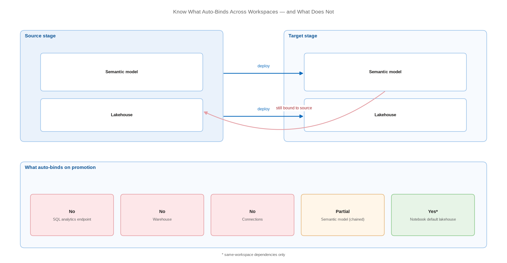

# Know What Auto-Binds Across Workspaces — and What Does Not

> The single table that explains most failed Fabric deployments.

*Series: Development management · Layer: Dependencies (3 of 5) · Audience: Fabric admins, platform engineers, and analytics developers · Level 300*

When content moves between workspaces, some references re-point themselves at the target workspace automatically and some keep pointing at the source. That difference is the root cause of most "it deployed successfully but it's reading from dev" incidents. This entry gives you the map.

## Scenario — when to use this

A deployment reported success, but a report in the target workspace is showing development data, or a notebook wrote to the wrong lakehouse. Nothing failed loudly — the content simply kept its original bindings.

Read this before configuring deployment rules (entry 13) or variable libraries (entry 11). Those are the fixes; this is the diagnosis. It applies to **every** deployment mechanism — Git, deployment pipelines, and the bulk import APIs — because binding behaviour is determined by how each item stores its references in its own definition.

For more detail on how this works, see:

- [Understand dependency binding in cross-workspace deployment — Microsoft Learn](https://learn.microsoft.com/en-us/fabric/cicd/cross-workspace-dependency-binding)
- [Assign a workspace to a deployment pipeline — Microsoft Learn](https://learn.microsoft.com/en-us/fabric/cicd/deployment-pipelines/assign-pipeline)

## What you'll set up

- A clear view of which dependencies auto-bind, which do not, and which are partial.
- A pre-deployment checklist for the items in your solution that need explicit remapping.
- A decision on which remediation to use for each: variable library, deployment rule, or parameter.

*Figure 8 — Deployment carries item definitions to the target workspace; auto-binding re-points some references while others keep pointing back at the source.*

## Prerequisites

- At least two workspaces and a means of moving content between them (entries 05-07).
- Read access to item definitions in Git, so you can inspect bindings (entry 03).

## Step 1 — Learn the binding table

| Dependency | Auto-binds to target? | What carries the reference |
| --- | --- | --- |
| **SQL analytics endpoint** (lakehouse) | **No** | Workspace-specific endpoint URL and database GUID in `expressions.tmdl` |
| **Warehouse** | **No** | Workspace-specific SQL analytics endpoint URL |
| **Semantic model** (chained / composite) | **Partial** | Connection strings referenced by name |
| **Notebook default lakehouse** | **Yes**, same-workspace deps | Notebook metadata; a deployment rule overrides it |
| **Connections** (data sources, gateways) | **No** | Connection references stored in the item definition |

> **Note** — Because binding depends on how each item stores its own references, the same behaviour applies to deployment pipelines, Git-based promotion, and the import (bulk) APIs alike. There is no deployment mechanism that fixes this for you.

## Step 2 — Inventory your solution

1. List every item that references another item or an external data source.
2. For each, open its definition in Git and find the reference (entry 03).
3. Mark it **auto**, **partial**, or **manual** using the table above.
4. Every **partial** and **manual** row is a deployment task, not an assumption.

## Step 3 — Choose the remediation per item

| Situation | Preferred remediation | Covered in |
| --- | --- | --- |
| Connection or endpoint used by pipelines, shortcuts, notebooks | **Variable library** with a value set per stage | Entry 11 |
| Direct Lake **on SQL** semantic model | **Data source deployment rule** | Entry 14 |
| Direct Lake **on OneLake** semantic model | **Parameter** in the connection expression | Entry 14 |
| Notebook default lakehouse | **Default lakehouse deployment rule** | Entry 15 |
| Data pipeline connections | **Variable library** or connection remapping | Entry 15 |

> **Tip** — Prefer variable libraries where the item type supports them. They keep every environment value in one auditable place, whereas deployment rules scatter configuration across per-item panes in the pipeline UI.

## Step 4 — Verify bindings after every deployment

1. After deploying, open the target-stage item and inspect its actual source, not just the deployment status.
2. For a semantic model, check the connection details point at the **target** workspace endpoint.
3. For a notebook, confirm the default lakehouse is the target-stage lakehouse.
4. Automate this as a post-deployment check so a silent mis-binding cannot reach users.

## Secured environment — what changes

- Cross-workspace bindings become cross-boundary calls. If the target workspace denies public access, verify the consuming item can still reach the source over the private path (entry 22).
- Connections referenced by promoted items must exist and be **permissioned** in the target workspace — a correct reference to a connection the target identity cannot use fails just as hard as a wrong reference.
- A **workspace identity** does not promote. Each workspace needs its own, and items relying on trusted workspace access must be rebound per stage.
- Where a variable library holds connection identifiers, restrict write access to it. A user with write access to the library but no access to the consuming items can still alter their behaviour.

## Validate

- Your inventory lists every cross-item and external reference in the solution.
- Each **manual** or **partial** reference has a named remediation and an owner.
- A test deployment to a lower stage produces items whose bindings all resolve to that stage.
- The post-deployment check fails loudly when you deliberately remove a deployment rule.

## Limitations & gotchas

- Deployment success is **not** binding success. The status only reports that definitions were copied.
- Direct Lake semantic models bind to the **source-stage** lakehouse when deployed without a rule — this is documented behaviour, not a defect.
- Notebook auto-binding covers dependencies **in the same workspace**; cross-workspace references are not auto-bound.
- Lakehouse auto-binding in Git requires the notebook setting **Lakehouse Auto-Binding in Git**, which is **off by default**.
- When a parameter controls a connection, auto-binding does not take place at all — you must change the parameter value or use a parameter rule, and the parameters must be of type **Text**.

## Rollback

1. If a deployment produced wrong bindings, correct them in the target stage directly, then fix the rule or variable so the next deployment is right.
2. Where a report has already published wrong data, re-point the item and refresh before notifying consumers.
3. Re-run the deployment after the remediation is in place and re-verify the bindings.

## References

- [Understand dependency binding in cross-workspace deployment — Microsoft Learn](https://learn.microsoft.com/en-us/fabric/cicd/cross-workspace-dependency-binding)
- [Assign a workspace to a deployment pipeline — Microsoft Learn](https://learn.microsoft.com/en-us/fabric/cicd/deployment-pipelines/assign-pipeline)
- [Direct Lake overview — Microsoft Learn](https://learn.microsoft.com/en-us/fabric/fundamentals/direct-lake-overview)
- [Notebook source control and deployment — Microsoft Learn](https://learn.microsoft.com/en-us/fabric/data-engineering/notebook-source-control-deployment)
- [What is a variable library? — Microsoft Learn](https://learn.microsoft.com/en-us/fabric/cicd/variable-library/variable-library-overview)
