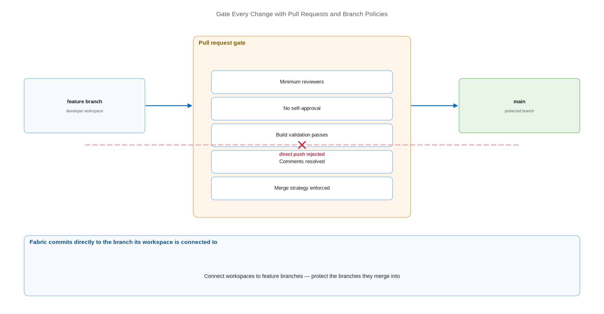

# Gate Every Change with Pull Requests and Branch Policies

> Make review, build validation, and approval mandatory before anything reaches a shared branch.

*Series: Development management · Layer: Governance (4 of 5) · Audience: Fabric admins, platform engineers, and analytics developers · Level 300*

Fabric commits directly to whatever branch a workspace is connected to. The control point is therefore not the workspace — it is the **branch policy** that decides what may merge into your shared and release branches. This entry puts that gate in place.

## Scenario — when to use this

Developers are committing to a shared branch from their workspaces and changes are reaching test without anyone reading them. You need review, an audit trail of who approved what, and automated validation before a merge.

Put this in place as soon as more than one person commits, and always before a branch is bound to a test or production workspace.

For more detail on the mechanisms available, see:

- [Set and manage branch policies in Azure Repos — Microsoft Learn](https://learn.microsoft.com/en-us/azure/devops/repos/git/branch-policies)
- [About protected branches — GitHub Docs](https://docs.github.com/en/repositories/configuring-branches-and-merges-in-your-repository/managing-protected-branches/about-protected-branches)

## What you'll set up

- Protected shared and release branches that reject direct pushes.
- A minimum reviewer count with self-approval disabled.
- Build validation that runs on every pull request.
- A merge strategy that keeps history readable.

*Figure 9 — A developer branch merges into the shared branch only after reviewers, build validation, and policy checks all pass.*

## Prerequisites

- A branching strategy in place (entry 05) with developer workspaces on their own branches (entry 06).
- In Azure DevOps, membership of **Project Administrators** or repository-level **Edit policies** permission.
- In GitHub, admin rights on the repository.
- A build pipeline already created, if you intend to require build validation.

## Step 1 — Protect the shared branch (Azure Repos)

1. Go to **Repos** → **Branches**, find the branch, select **More options** → **Branch policies**.
2. Set **Require a minimum number of reviewers** to **On** and choose a count — two is a common floor.
3. Enable **Prohibit the most recent pusher from approving their own changes** to enforce separation of duties.
4. Under **When new changes are pushed**, select **Require at least one approval on every iteration** so a late change cannot ride in on an old approval.
5. Set **Check for comment resolution** to **On** so review threads must be closed before merge.

## Step 2 — Add build validation

1. Select **+** next to **Build validation**.
2. Choose the **Build pipeline** that validates your Fabric content.
3. Set **Trigger** to **Automatic** so a build queues whenever the pull request is created or updated.
4. Set **Policy requirement** to **Required**.
5. Choose a build expiration so an update to the protected branch invalidates a stale passing build.

> **Tip** — Even a modest validation build pays for itself: parse every changed `.platform` file, assert that no `expressions.tmdl` contains a hard-coded development endpoint, and fail the build if it does. That one check prevents the most common promotion defect in Fabric.

## Step 3 — Fix the merge strategy

1. Set **Limit merge types** to **On**.
2. Allow **Squash merge** to keep one commit per change on the shared branch, which makes the branch history legible and revertible.
3. Optionally require **linked work items** so every change traces to a ticket.

## Step 4 — The GitHub equivalent

1. Open **Settings** → **Branches** → add a branch protection rule for the shared and release branches.
2. Enable **Require a pull request before merging** and set the required number of approvals.
3. Enable **Require status checks to pass before merging** and select your validation workflow.
4. Enable **Require conversation resolution before merging**.
5. Enable **Do not allow bypassing the above settings** so administrators are held to the same rule.

## Secured environment — what changes

- Fabric cannot commit to a branch whose policy blocks direct commits. Connect workspaces to **feature** or **development** branches and reserve protected status for the branches those merge into.
- Grant **bypass policy** permissions to as few identities as possible, and never at project or repository scope. Policies are the audit trail; a broad bypass empties it.
- Add a **branch control** check on protected resources so deployments can only originate from approved branches, with branch protection required.
- Require signed commits where your provider supports it, so authorship in the audit trail is cryptographically attributable.
- In regulated environments, the pull request record — who wrote, who reviewed, who approved, when — is frequently the evidence an auditor asks for. Keep it complete rather than convenient.

## Validate

- A direct push to the protected branch is rejected.
- A pull request cannot complete with fewer than the required approvals.
- The author cannot self-approve when self-approval is disabled.
- Build validation queues automatically on pull request creation and blocks merge on failure.
- A Fabric commit from a connected development workspace still succeeds.

## Limitations & gotchas

- Branch names in branch-control checks must be **fully qualified** — `refs/heads/<branch name>`.
- A branch counts as protected if **at least one** policy applies to it, including repository-level policies. "Protected" does not imply "well protected".
- The list of eligible approvers is fixed when checks start running; adding approvers mid-run has no effect.
- If a group is an approver, only **one** member needs to approve.
- Fabric's own commits are subject to the same policies — an over-tight policy on a workspace-connected branch will break the Source control panel.

## Rollback

1. To relax a policy, set it to **Optional** rather than deleting it — you keep the signal without the block.
2. In Azure Repos, disable individual policies from the branch policy page; in GitHub, edit or delete the branch protection rule.
3. A branch with required policies cannot be deleted until those policies are removed.

## References

- [Set and manage branch policies in Azure Repos — Microsoft Learn](https://learn.microsoft.com/en-us/azure/devops/repos/git/branch-policies)
- [About protected branches — GitHub Docs](https://docs.github.com/en/repositories/configuring-branches-and-merges-in-your-repository/managing-protected-branches/about-protected-branches)
- [Define approvals and checks — Microsoft Learn](https://learn.microsoft.com/en-us/azure/devops/pipelines/process/approvals)
- [The Git integration process — Microsoft Learn](https://learn.microsoft.com/en-us/fabric/cicd/git-integration/git-integration-process)
- [Fabric CI/CD best practices — Microsoft Learn](https://learn.microsoft.com/en-us/fabric/cicd/best-practices-cicd)
