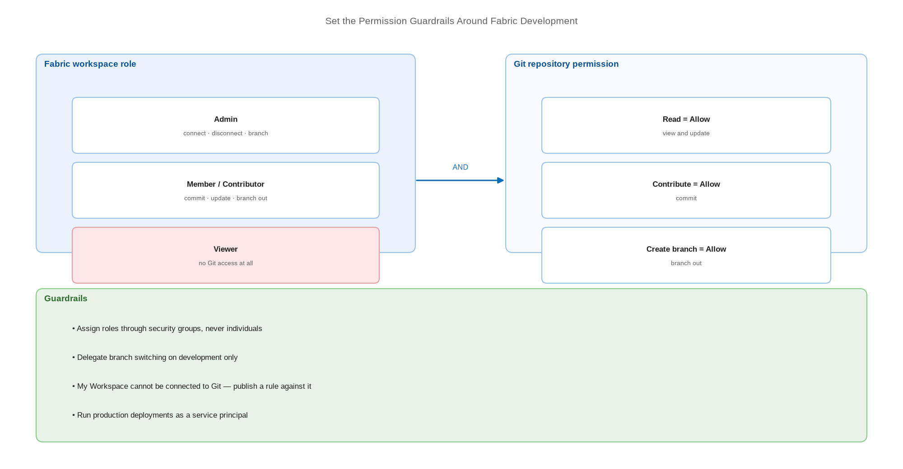

# Set the Permission Guardrails Around Fabric Development

> Decide who may connect, commit, branch, and deploy — before someone decides for you.

*Series: Development management · Layer: Governance (5 of 5) · Audience: Fabric admins, platform engineers, and analytics developers · Level 300*

Fabric CI/CD permissions are the intersection of two systems: **workspace roles** on the Fabric side and **repository permissions** on the Git side. An identity needs the right level in both, and most access problems are a mismatch between them. This entry sets the guardrails.

## Scenario — when to use this

Developers can see the Source control panel but commits fail, or someone who should not be able to has just switched a production workspace to a different branch. Permissions were assembled ad hoc and nobody can state the intended model.

Do this alongside topology (entry 07). The two together define your development guardrails.

For more detail on the permission model, see:

- [The Git integration process — Microsoft Learn](https://learn.microsoft.com/en-us/fabric/cicd/git-integration/git-integration-process)
- [Roles in workspaces in Microsoft Fabric — Microsoft Learn](https://learn.microsoft.com/en-us/fabric/fundamentals/roles-workspaces)

## What you'll set up

- Workspace roles assigned by security group, matched to Git repository permissions.
- A deliberate decision on delegated branch switching.
- A governance position on **My Workspace**.
- A documented permission matrix your team can actually check against.

*Figure 10 — Every Git operation requires a matching pair of permissions: a Fabric workspace role and a Git repository permission.*

## Prerequisites

- Workspaces created and assigned to capacity (entry 07).
- Security groups created for each access tier.
- Administrative access to the Git repository to set permissions.

## Step 1 — Learn the paired permission model

| Operation | Fabric workspace role | Azure Repos permission |
| --- | --- | --- |
| Connect workspace to Git | **Admin** only | Read = Allow |
| Disconnect workspace from Git | **Admin** only | None needed |
| View Git connection details | Admin, Member, Contributor | Read or None |
| Commit workspace changes | Contributor with **write on all items** | Read + Contribute = Allow |
| Update from Git | Contributor with **write on all items** | Read = Allow |
| Create a branch from Fabric | Admin; Member/Contributor if delegated | Write + Create branch = Allow |
| Branch out to another workspace | Admin, Member, Contributor | Read + Create branch = Allow |

> **Note** — A **Viewer** can perform no Git actions at all and cannot even see Git information in the workspace. If a user reports the Source control panel is missing, check their workspace role before anything else.

## Step 2 — Assign roles through security groups

1. Create a group per tier — for example `fabric-<solution>-developers`, `fabric-<solution>-testers`, `fabric-<solution>-readers`.
2. Assign the group, not the person, to the workspace role. Everyone in the group inherits it, including through nested groups.
3. Where a user is in several groups, they receive the **highest** permission any of those roles grants.
4. Add the CI/CD service principal to workspace roles directly — service principals can hold workspace roles and inherit the same permissions as users for API operations.

## Step 3 — Decide on delegated branch switching

The workspace setting **Allow users with at least Contributor role to change Git branch** moves branch switching from admin-only to Contributor-and-above.

1. Enable it on **development** workspaces so developers can self-serve.
2. Leave it **disabled** on test and production, where a branch switch is a release event.
3. Note there is no tenant-level switch — this is decided per workspace, so it must be part of your workspace provisioning checklist.

> **Note** — Switching a branch deletes items that exist in the old branch but not the new one, and the deletion cannot be undone. That is why the capability stays with admins on the stages that matter.

## Step 4 — Take a position on My Workspace

**My Workspace cannot be connected to a Git provider.** Anything built there is outside source control, invisible to review, and unrecoverable through your deployment process.

1. Publish a clear rule that solution content is never developed in My Workspace.
2. Give every developer a branched workspace (entry 06) so they have a legitimate private space.
3. Audit periodically for solution-shaped content in personal workspaces and migrate it into a governed workspace.

## Secured environment — what changes

- From **December 1, 2026**, users without read-write permissions on workspace items cannot use Git integration. This can also cause loss of access to items because of sensitivity labels and protection policies applied to them. Audit read-only committers now.
- Your Fabric authentication must be at least as strong as your Git provider's — if Git requires multifactor authentication, so must Fabric.
- Run production deployments as a **service principal**, not a person, so promotion does not depend on an individual's account (entry 21).
- Where a security group grants a workspace role, changes to that group take effect in Fabric — group membership review is part of your access review, not separate from it.
- Review **bypass** permissions on both sides: policy bypass in Git, and workspace Admin in Fabric. These are the two ways the guardrails are legitimately circumvented.

## Validate

- A Contributor can commit and update, but cannot connect or disconnect the workspace.
- A Viewer sees no Source control panel.
- On production, a Contributor cannot switch branches; on development, they can.
- The CI/CD service principal can perform every operation your automation requires — test it before the automation depends on it.

## Limitations & gotchas

- Fabric role and Git permission must **both** be sufficient. A workspace Admin without repository Contribute cannot commit.
- Workspace **Admin**, **Member**, and **Contributor** all grant write access to OneLake — there is no write-free authoring role.
- Gateway permissions are managed separately from workspace roles and are not covered by any of this.
- A fine-grained GitHub token needs **Contents: Read and write** to commit; a classic token needs the `repo` scope.
- B2B (guest) users are not supported for Git integration.

## Rollback

1. To reduce access, remove the security group from the workspace role — changes take effect for every member at once.
2. To revoke delegated branch switching, disable **Allow users with at least Contributor role to change Git branch** in workspace settings.
3. To cut off Git access entirely without changing Fabric roles, remove the repository permission on the Git side.

## References

- [The Git integration process — Microsoft Learn](https://learn.microsoft.com/en-us/fabric/cicd/git-integration/git-integration-process)
- [Roles in workspaces in Microsoft Fabric — Microsoft Learn](https://learn.microsoft.com/en-us/fabric/fundamentals/roles-workspaces)
- [Get started with Git integration — Microsoft Learn](https://learn.microsoft.com/en-us/fabric/cicd/git-integration/git-get-started)
- [Security considerations for Fabric CI/CD — Microsoft Learn](https://learn.microsoft.com/en-us/fabric/cicd/cicd-security)
- [Git integration tenant settings — Microsoft Learn](https://learn.microsoft.com/en-us/fabric/admin/git-integration-admin-settings)
