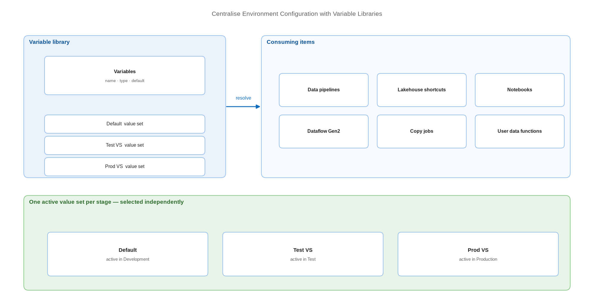

# Centralise Environment Configuration with Variable Libraries

> Put every environment-specific value in one item with a value set per stage.

*Series: Environment promotion · Layer: Parameterisation (1 of 5) · Audience: Fabric admins, platform engineers, and analytics developers · Level 300*

A variable library is a workspace item holding a list of variables and their values for each stage of your release. It is the modern, auditable answer to "this connection string is different in production" — and it replaces a great deal of per-item deployment-rule configuration.

## Scenario — when to use this

Your solution carries connection strings, workspace identifiers, lakehouse names, or endpoint URLs that differ per stage. Today those values are edited by hand after each deployment, or scattered across deployment rules that nobody can inventory.

Reach for a variable library first whenever the consuming item type supports it. Fall back to deployment rules (entry 13) only for item types that variable libraries do not yet cover.

For more detail on how this works, see:

- [What is a variable library? — Microsoft Learn](https://learn.microsoft.com/en-us/fabric/cicd/variable-library/variable-library-overview)
- [Lifecycle management for variable libraries — Microsoft Learn](https://learn.microsoft.com/en-us/fabric/cicd/variable-library/variable-library-cicd)

## What you'll set up

- A **variable library** item in each workspace of your solution.
- A **default** value set plus one alternative value set per stage.
- Consuming items — pipelines, notebooks, shortcuts, dataflows — reading values from the library.
- The correct **active** value set selected in each deployment-pipeline stage.



*Figure 11 — One variable library, several value sets; each stage activates its own set and every consuming item reads the right value automatically.*

## Prerequisites

- A workspace on a Fabric capacity, ideally already Git-connected (entry 02).
- Workspace **Contributor** or higher to create items.
- A list of the environment-specific values in your solution — the inventory from entry 08.

## Step 1 — Create the variable library

1. In the workspace, select **+ New item**.
2. Scroll to the **Develop data** section and select **Variable library**. (From the sidebar, the same item sits under **Create** → **Data Factory**.)
3. Name the library and select **Create**.

> **Tip** — One library per solution, not per item. The value of the pattern is that a reviewer can open a single item and see every environment difference the solution has.

## Step 2 — Add variables

1. Select **+ New variable**.
2. Enter a name, select a **type**, and enter a **default value**.
3. Add a **note** describing what the variable controls — up to 2,048 characters.
4. Select **Save**.

Supported types are **Boolean**, **Datetime**, **Guid**, **Integer**, **Number**, and **String**.

> **Note** — **Number** types are not supported in data pipelines. If a pipeline will consume the value, use Integer or String.

## Step 3 — Add a value set per stage

1. Select **Add value set**.
2. Name it for the stage it serves — for example `Test VS` or `Prod VS`.
3. Add an optional description of up to 2,048 characters.
4. Enter values for **all** variables in the library.
5. Select **Set as active** if this set should be the active one in the current workspace, then select **Save**.

To change a set later, select the ellipsis beside its name and choose **Set as active**, **Rename**, or **Delete**.

## Step 4 — Consume the variables

These item types can read from a variable library today: **data pipelines**, **lakehouse shortcuts**, **notebooks** (through NotebookUtils and `%%configure`), **Dataflow Gen2**, **copy jobs**, **user data functions**, and **plans**.

In a data pipeline, create the reference in the bottom panel with **+ New**, then use **Add dynamic content** in the activity settings. If **Library variables** is not visible, select the three dots next to **Functions** and choose **Library variables**. The expression takes this shape:

```
@pipeline().libraryVariables.SourceLakehouse
```

> **Tip** — For **Connection reference** and **Item reference** types, append a `.` to reach the properties — connection ID, item ID, or item workspace. That is what lets one variable carry a complete, stage-correct binding rather than a bare string.

## Step 5 — Set the active value set per pipeline stage

1. Open your deployment pipeline (entry 12).
2. Select the **Test** stage, then select the variable library item.
3. Select the ellipsis on the correct value set and choose **Set as active**.
4. Repeat for each stage. All value sets are available to every stage, but only **one is active per stage**, and each stage is selected independently.

> **Note** — The active value set is part of item **configuration**, not item **definition**. Changing it does not register as *Different from source* in a comparison, and it is **not overwritten** on each deployment — which is exactly why the pattern is stable across releases.

## Secured environment — what changes

- A variable library is **not a secret store**. It holds configuration, not credentials. Keep secrets in Azure Key Vault and reference them through connections (entry 24).
- Restrict write access to the library. A user with write access to a variable library but no access to the consuming items can still alter those items' behaviour — Microsoft documents this explicitly as a security consideration.
- Where variables carry **connection references**, the target connection must exist and be permissioned in the target workspace, or the promoted item fails despite a correct reference.
- The library is source-controlled as `variables.json`, `settings.json`, a `valueSets` folder, and `.platform` — so every environment value change is visible in a pull request diff. Treat changes to `valueSets` as review-worthy.

## Validate

- Each stage shows the intended active value set.
- A consuming pipeline resolves the variable at runtime to the value for its stage.
- Deploying to the next stage leaves the target stage's active value set unchanged.
- The repository shows the value sets as separate JSON files under `valueSets`.

## Limitations & gotchas

- Up to **1,000 variables** and **1,000 value sets**, provided the total number of cells across alternative value sets stays below **10,000** and the item stays under **1 MB**.
- Value sets appear in the order they were added and **cannot be reordered in the UI** — edit the JSON directly to change the order.
- Value set names must be unique, and so must variable names.
- There is always exactly **one** active value set, and you **cannot delete a value set while it is active**.
- Not every item type can consume variables. Semantic models are not on the supported list — see entry 14 for Direct Lake.

## Rollback

1. To revert a stage, set its previous value set active again — configuration only, no redeployment needed.
2. To remove a variable, delete it from the library and update every consuming item, or those items fail to resolve it.
3. To abandon the pattern, replace variable references with literal values in each consuming item before deleting the library.

## References

- [What is a variable library? — Microsoft Learn](https://learn.microsoft.com/en-us/fabric/cicd/variable-library/variable-library-overview)
- [Create and manage variable libraries — Microsoft Learn](https://learn.microsoft.com/en-us/fabric/cicd/variable-library/get-started-variable-libraries)
- [Lifecycle management for variable libraries — Microsoft Learn](https://learn.microsoft.com/en-us/fabric/cicd/variable-library/variable-library-cicd)
- [Tutorial: use variable libraries to share item configurations — Microsoft Learn](https://learn.microsoft.com/en-us/fabric/cicd/variable-library/tutorial-variable-library)
- [Variable library integration with data pipelines — Microsoft Learn](https://learn.microsoft.com/en-us/fabric/data-factory/variable-library-integration-with-data-pipelines)
