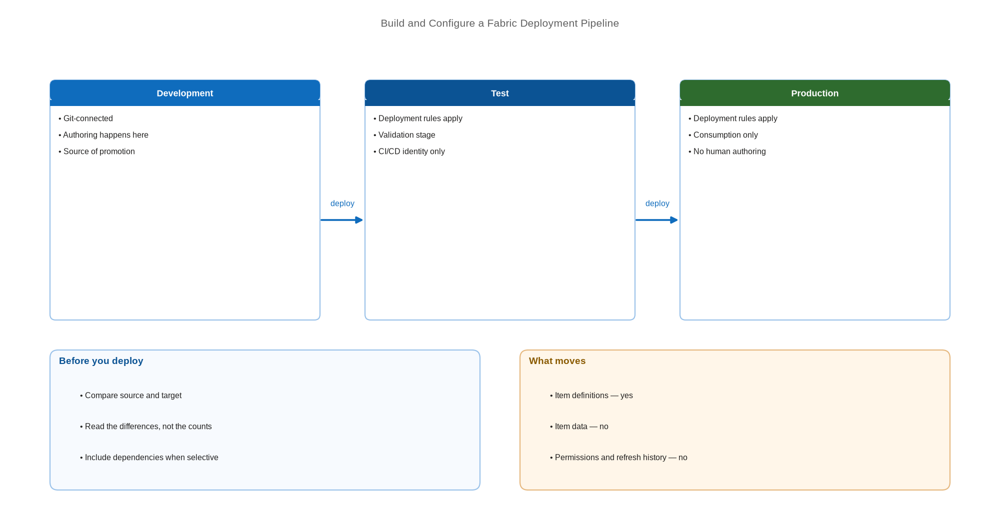

# Build and Configure a Fabric Deployment Pipeline

> Wire development, test, and production into stages and promote content without touching Git.

*Series: Environment promotion · Layer: Promotion (2 of 5) · Audience: Fabric admins, platform engineers, and analytics developers · Level 300*

A deployment pipeline binds your environment workspaces into ordered stages and copies content from one to the next. It is the lower-friction of Fabric's two CI/CD workflow options — no Git knowledge required of the people promoting — and it is the right default for teams whose release process is a human decision rather than an automated trigger.

## Scenario — when to use this

You have development, test, and production workspaces (entry 07) and need a repeatable way to move content between them. Today, promotion means re-creating items by hand or exporting and re-importing, and no two releases are performed identically.

Choose deployment pipelines when the promotion decision is made by a person in the Fabric portal. Choose Git-based release branches (entry 05) when promotion should be triggered by a merge, or when private-link restrictions rule pipelines out — see the secured-environment section below.

For more detail on how this option works, see:

- [Introduction to deployment pipelines — Microsoft Learn](https://learn.microsoft.com/en-us/fabric/cicd/deployment-pipelines/intro-to-deployment-pipelines)
- [CI/CD workflow options in Fabric — Microsoft Learn](https://learn.microsoft.com/en-us/fabric/cicd/manage-deployment)

## What you'll set up

- A deployment pipeline with a stage per environment.
- A workspace assigned to each stage.
- A first deployment from development to test, with content compared before it moves.
- A deployment history you can point at when someone asks what changed.

*Figure 12 — A three-stage deployment pipeline: content is compared, then promoted stage by stage, with deployment rules applied on arrival.*

## Prerequisites

- Workspaces for each stage, each assigned to a **Fabric capacity**.
- You are a workspace **Admin** on each workspace you intend to assign.
- Item types in scope are supported by deployment pipelines — check before you rely on it.
- Semantic models are upgraded to **Enhanced Metadata**.

> **Note** — From **February 12, 2026**, Fabric deployment pipelines retire support for semantic models that are not upgraded to Enhanced Metadata. Audit your models before building the pipeline, not after a deployment fails.

## Step 1 — Create the pipeline

1. In the Fabric portal, create a new **deployment pipeline** and give it a name that identifies the solution.
2. Define the stages. Three — **Development**, **Test**, **Production** — is the standard shape, and stages can be added or renamed to match your process.
3. Save the pipeline.

## Step 2 — Assign a workspace to each stage

1. Select a stage and choose **Assign a workspace**.
2. Pick the workspace for that stage. You must be an admin of the workspace to assign it.
3. Repeat for every stage, in order.
4. Confirm each stage shows the expected item count.

> **Tip** — Assign in stage order and deploy immediately after assigning the first pair. Discovering a binding problem (entry 08) on a two-item test deployment is far cheaper than discovering it on a full release.

## Step 3 — Compare before you deploy

1. Select the source stage and review the comparison against the target stage.
2. Items are marked **New**, **Different**, or **Same** — read the differences rather than trusting the counts.
3. Investigate anything unexpectedly marked *Different*; it often indicates a change made directly in the target stage.

## Step 4 — Deploy

1. Choose **Deploy** to promote everything, or select individual items for a **selective deployment**.
2. When deploying selectively, include dependencies — a promoted item whose dependency stays behind will bind to the source stage.
3. Add a deployment note describing the change.
4. Confirm the deployment and watch it complete.
5. Review the **deployment history** entry it creates.

> **Note** — Deployment copies item **definitions**, not item **data**. A lakehouse arrives in the target stage as a lakehouse — its tables are not copied with it.

## Secured environment — what changes

- **This is the decisive constraint.** If any workspace in a deployment pipeline is set to deny public access, deployment pipelines **cannot connect to that workspace** — and configuring inbound restriction is **blocked** for any workspace already assigned to a pipeline.
- That makes deployment pipelines and workspace-level private links mutually exclusive today. In a private-link estate, use Git-based promotion plus the REST APIs over the private path instead (entries 16-17 and 22).
- Where pipelines are viable, run promotion through the **Deploy Stage Content** API as a service principal (entry 17) so releases are automated, attributable, and gated by approvals rather than performed by hand.
- Restrict pipeline access: whoever can deploy to the production stage can change what users see. Treat that as a privileged permission and review it with your access reviews.

## Validate

- Every stage shows its assigned workspace and the expected items.
- A trivial change deploys from development to test and appears in the test workspace.
- The deployment history records the deployment, the actor, and your note.
- Bindings in the target stage resolve to the **target** stage, not the source (entry 08).

## Limitations & gotchas

- There is **no single deployment-pipelines limitations page**. The documented limits live in the *Considerations and limitations* sections of the deployment process, deployment rules, and workspace assignment articles, plus the per-item pages.
- Deployment moves definitions only — data, refresh history, and permissions do not travel.
- Unsupported item types are simply not deployed.
- Direct Lake semantic models **do not** automatically bind to target-stage items (entry 14).
- A workspace can be assigned to only one stage of one pipeline at a time.

## Rollback

1. Deployment pipelines have no built-in undo. To revert, deploy a known-good version forward from the earlier stage.
2. Where the earlier stage has already moved on, restore the item definition from Git and redeploy (entry 04).
3. To dismantle a pipeline, unassign the workspaces from each stage and delete it. Workspaces and their content are unaffected.

## References

- [Introduction to deployment pipelines — Microsoft Learn](https://learn.microsoft.com/en-us/fabric/cicd/deployment-pipelines/intro-to-deployment-pipelines)
- [Get started with deployment pipelines — Microsoft Learn](https://learn.microsoft.com/en-us/fabric/cicd/deployment-pipelines/get-started-with-deployment-pipelines)
- [Assign a workspace to a deployment pipeline — Microsoft Learn](https://learn.microsoft.com/en-us/fabric/cicd/deployment-pipelines/assign-pipeline)
- [Deploy content to a target stage — Microsoft Learn](https://learn.microsoft.com/en-us/fabric/cicd/deployment-pipelines/deploy-content)
- [Understand the deployment process — Microsoft Learn](https://learn.microsoft.com/en-us/fabric/cicd/deployment-pipelines/understand-the-deployment-process)
- [CI/CD workflow options in Fabric — Microsoft Learn](https://learn.microsoft.com/en-us/fabric/cicd/manage-deployment)
