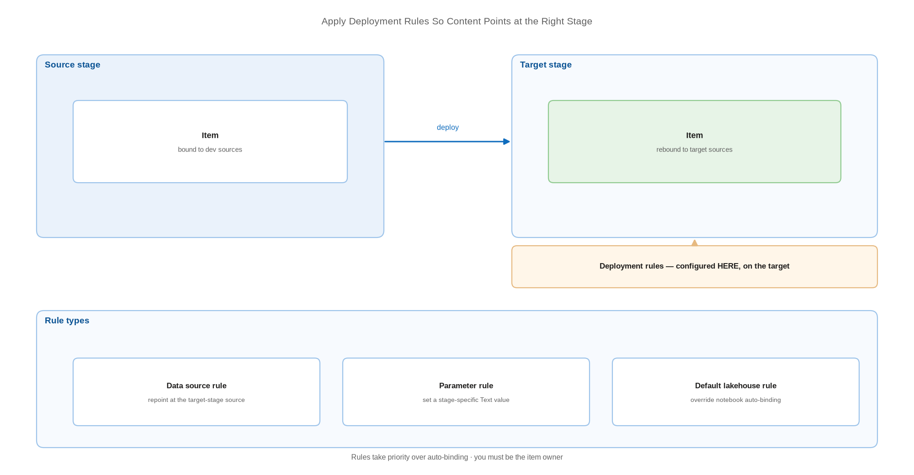

# Apply Deployment Rules So Content Points at the Right Stage

> Override source-stage bindings with per-item rules on the target stage.

*Series: Environment promotion · Layer: Promotion (3 of 5) · Audience: Fabric admins, platform engineers, and analytics developers · Level 300*

A deployment rule tells Fabric: when this item arrives in this stage, change this reference to that value. Rules are how a deployment pipeline turns a copy of development content into working test or production content — and they are configured on the **target** stage, by the item **owner**.

## Scenario — when to use this

Content promotes successfully but keeps reading from the source stage — the classic symptom described in entry 08. You need the promoted items to re-point at target-stage data sources without editing them by hand after every release.

Use rules for item types that variable libraries do not cover, and for the specific case of Direct Lake on SQL semantic models (entry 14). Prefer variable libraries (entry 11) everywhere else, because rules are configured per item, per stage, and are easy to lose track of.

For more detail on how this works, see:

- [Create deployment rules — Microsoft Learn](https://learn.microsoft.com/en-us/fabric/cicd/deployment-pipelines/create-rules)
- [Assign a workspace to a deployment pipeline — Microsoft Learn](https://learn.microsoft.com/en-us/fabric/cicd/deployment-pipelines/assign-pipeline)

## What you'll set up

- Data source rules that re-point items at target-stage sources.
- Parameter rules that set stage-specific parameter values.
- Default lakehouse rules for notebooks (covered in depth in entry 15).
- A record of which rules exist, so they are maintained rather than discovered.

*Figure 13 — Deployment rules are configured on the target stage and applied as content arrives, overriding the bindings carried from the source stage.*

## Prerequisites

- A deployment pipeline with workspaces assigned to each stage (entry 12).
- You are the **owner** of each item you intend to write a rule for — rule creation requires item ownership.
- The item exists in the target stage, which means it must have been deployed there at least once.
- The target-stage data sources exist and you know their identifiers.

> **Note** — Create rules on the **target** stage — Test or Production — never on Development. A rule on the development stage has nothing to act on.

## Step 1 — Open the rules pane

1. Open the deployment pipeline and select the **target** stage.
2. Find the item and select **Deployment rules**.
3. The **Set deployment rules** pane opens with the rule types available for that item type.

## Step 2 — Add a data source rule

1. Select the data source tile in the rules pane.
2. Use the **From** dropdown to pick the source-stage data source.
3. Use the **To** dropdown to pick the target-stage equivalent, or supply the target details explicitly.
4. Save the rule.

This is the mechanism that re-points a semantic model at the target-stage SQL analytics endpoint — the documented remedy for Direct Lake on SQL models, which do not auto-bind.

## Step 3 — Add a parameter rule

1. Select the parameter tile in the rules pane.
2. Choose the parameter and enter the value it should take in this stage.
3. Save the rule.

> **Note** — When a **parameter** controls a connection, auto-binding does not take place at all. You must change the parameter value after deployment or set a parameter rule — and the parameters must be of type **Text**.

## Step 4 — Record what you created

1. List every rule, the item it applies to, and the stage it lives on.
2. Store that list beside your solution documentation in the repository.
3. Review it whenever an item is renamed, re-owned, or removed — rules do not follow those changes reliably.

> **Tip** — The maintenance burden is the real cost of deployment rules. A manufacturing analytics team with forty items and two target stages can accumulate eighty rules that only one person understands. Variable libraries (entry 11) collapse most of that into one reviewable item — use rules for what libraries cannot do.

## Secured environment — what changes

- Rules require item **ownership**, which conflicts with the principle that nobody authors in production. Where the CI/CD service principal deploys content, it becomes the owner — so it is the identity that must configure the rules, via the API (entry 17).
- A rule pointing at a target-stage source only works if the deploying identity can **reach and use** that source. Verify connection permissions in the target workspace, not just the rule configuration.
- Rules are configuration held in the pipeline, not in Git. They are **not** captured in your pull request history — document them explicitly, or your repository is not a complete record of how production is configured.
- Deployment pipelines are unavailable to workspaces that deny public inbound access (entry 12), so in a fully private estate, rules are not the tool — parameterisation in the item definition is.

## Validate

- Deploy to the target stage and open the item — its source resolves to the **target** stage.
- For a semantic model, inspect the connection details and confirm the target endpoint.
- Remove a rule deliberately, redeploy, and confirm the item reverts to the source binding. That proves the rule is doing the work.
- Confirm every item in your entry 08 inventory marked *manual* now has a rule or a variable.

## Limitations & gotchas

- Rules are created **per item, per target stage** — they do not cascade across stages or apply to newly added items.
- You must be the item **owner** to create a rule. A change of owner can silently orphan rules.
- **Deployment rules take priority over auto-binding.** Where both apply, the rule wins — which is occasionally the cause of the mis-binding rather than the fix for it.
- Direct Lake **on OneLake** semantic models do **not** support deployment rules to rebind the data source; use a parameter expression instead (entry 14).
- Rule availability differs by item type; a tile that exists for one item type may be absent for another.

## Rollback

1. Open the rules pane on the target stage and delete the rule.
2. Redeploy — the item reverts to its auto-bound or source-stage binding.
3. If the rule was masking a bad binding, fix the binding in the source item rather than reinstating the rule.

## References

- [Create deployment rules — Microsoft Learn](https://learn.microsoft.com/en-us/fabric/cicd/deployment-pipelines/create-rules)
- [Assign a workspace to a deployment pipeline — Microsoft Learn](https://learn.microsoft.com/en-us/fabric/cicd/deployment-pipelines/assign-pipeline)
- [Understand dependency binding in cross-workspace deployment — Microsoft Learn](https://learn.microsoft.com/en-us/fabric/cicd/cross-workspace-dependency-binding)
- [Understand the deployment process — Microsoft Learn](https://learn.microsoft.com/en-us/fabric/cicd/deployment-pipelines/understand-the-deployment-process)
- [What is a variable library? — Microsoft Learn](https://learn.microsoft.com/en-us/fabric/cicd/variable-library/variable-library-overview)
