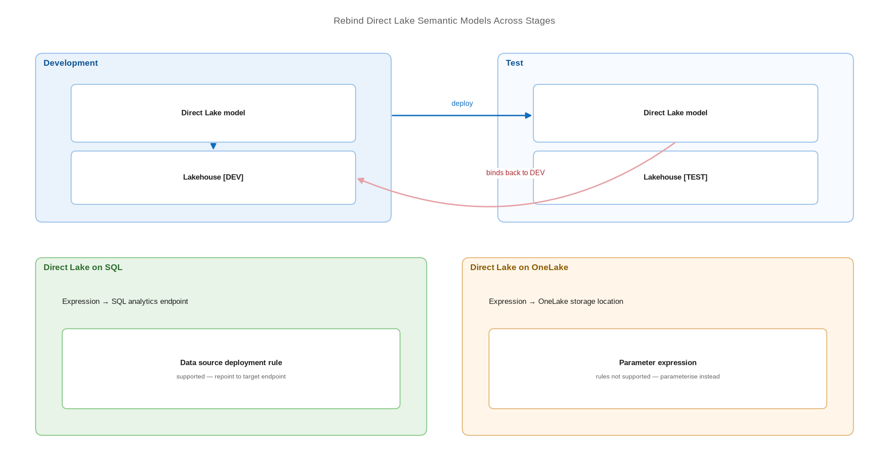

# Rebind Direct Lake Semantic Models Across Stages

> The one item type that does not follow the rules — and the two supported ways to fix it.

*Series: Environment promotion · Layer: Promotion (4 of 5) · Audience: Fabric admins, platform engineers, and analytics developers · Level 300*

Deploy a Direct Lake semantic model alongside its lakehouse and the model in the target stage binds to the lakehouse in the **source** stage. This is documented behaviour, not a defect, and it is the single most common surprise in Fabric CI/CD. The supported fix depends on which kind of Direct Lake model you have.

## Scenario — when to use this

You deployed from development to test. The deployment succeeded. The lakehouse is in test, the notebooks are in test — and the semantic model is still reading development data. Inspecting the model's TMDL shows the development lakehouse ID and workspace ID still in place.

Teams commonly work around this by rebinding the model after each deployment with a script. That works, but it is a manual step in every release. This entry replaces it with a supported, repeatable configuration.

For more detail on the documented behaviour, see:

- [Direct Lake overview — Microsoft Learn](https://learn.microsoft.com/en-us/fabric/fundamentals/direct-lake-overview)
- [Assign a workspace to a deployment pipeline — Microsoft Learn](https://learn.microsoft.com/en-us/fabric/cicd/deployment-pipelines/assign-pipeline)
- [Understand dependency binding in cross-workspace deployment — Microsoft Learn](https://learn.microsoft.com/en-us/fabric/cicd/cross-workspace-dependency-binding)

## What you'll set up

- A clear identification of whether your model is **Direct Lake on SQL** or **Direct Lake on OneLake**.
- For Direct Lake on SQL: a **data source deployment rule** re-pointing the model at the target endpoint.
- For Direct Lake on OneLake: a **parameter expression** in the connection string, set per stage.
- A post-deployment check that proves the model reads from the correct stage.

*Figure 14 — Without intervention a Direct Lake model deployed to Test still reads the Dev lakehouse; a data source rule or a parameter expression re-points it.*

## Prerequisites

- A deployment pipeline with the model and its lakehouse or warehouse present in both stages (entry 12).
- Item **ownership** of the semantic model, to create deployment rules.
- The target-stage SQL analytics endpoint URL and database identifier.
- The model is upgraded to **Enhanced Metadata**.

## Step 1 — Identify which Direct Lake mode you have

The two modes differ in what the model expression points at, and the difference decides your remediation:

|  | Direct Lake on SQL | Direct Lake on OneLake |
| --- | --- | --- |
| Expression points at | The **SQL analytics endpoint** of the lakehouse or warehouse | The **OneLake storage location** of the data source |
| Connector used | SQL Server connector, or `OneLake.SqlAnalytics()` | Azure Data Lake Storage connector |
| Deployment rules rebind the data source? | **Supported** | **Not supported directly** |
| Supported remedy | Data source deployment rule | Parameter expression in the connection string |

1. Open the model definition in Git and read `expressions.tmdl` (entry 03).
2. A SQL analytics endpoint URL indicates **Direct Lake on SQL**; a OneLake storage path indicates **Direct Lake on OneLake**.

## Step 2 — Direct Lake on SQL: create a data source rule

1. Open the deployment pipeline and select the **target** stage.
2. Find the semantic model and select **Deployment rules**.
3. Add a **data source** rule.
4. Set **From** to the source-stage SQL analytics endpoint and **To** to the target-stage endpoint.
5. Save, then redeploy so the rule is applied on arrival.

> **Note** — This is the documented remedy: when you deploy a Direct Lake semantic model it does not automatically bind to items in the target stage, and you use **data source rules** to bind it to an item in the target stage. Other semantic model types bind to the paired item automatically.

## Step 3 — Direct Lake on OneLake: parameterise the expression

Deployment rules cannot rebind the data source for Direct Lake on OneLake. The documented alternative is to create a **parameter expression** used in the connection string, then set that parameter per stage.

1. In the model, define a parameter of type **Text** holding the workspace or storage location.
2. Reference that parameter from the connection expression rather than hard-coding the location.
3. In the deployment pipeline, add a **parameter rule** on the target stage setting the parameter to the target value (entry 13).
4. Redeploy and confirm the parameter rule applied.

> **Note** — When a parameter controls the connection, auto-binding does not take place at all. The parameter value becomes the only thing that decides where the model reads from — so the parameter rule is mandatory, not optional.

## Step 4 — Prove it with a post-deployment check

1. After deployment, open the model in the target workspace and inspect its connection details.
2. Confirm the endpoint and database identifiers belong to the **target** stage.
3. Alternatively, read the deployed model's TMDL and assert the target workspace ID appears — this is a good automated gate in a release pipeline (entry 19).
4. Refresh a visual that depends on stage-specific data and confirm the values are the target stage's.

> **Tip** — Make this check a hard gate rather than a manual look. A one-line assertion that the deployed model's expression contains the target workspace ID catches the failure before users do — and it is the difference between a controlled release process and a hopeful one.

## Secured environment — what changes

- Workspaces with **workspace-level private links enabled cannot contain Power BI semantic models** — if a workspace holds one, private links cannot be enabled for it at all. Plan model placement and network posture together.
- Because deployment pipelines are unavailable to workspaces denying public access (entry 12), a fully private estate cannot use deployment rules for rebinding. Parameterise the model definition and set the parameter through your Git-based deployment tooling instead (entries 19-20).
- Creating a Direct Lake semantic model in a workspace in a **different region** from its data source workspace is not supported — a constraint that frequently surfaces when production sits in a dedicated, regionally-pinned capacity.
- Where a model binds to a fixed identity or a cloud connection, that connection must exist and be permissioned in every stage. Rebinding the endpoint without rebinding the identity produces an authentication failure rather than a data error.

## Validate

- The deployed model's connection details reference the **target** stage endpoint and database.
- A visual bound to stage-distinguishable data shows the target stage's values.
- Redeploying does not revert the binding.
- Removing the rule and redeploying reproduces the source-stage binding — confirming the rule is what fixes it.

## Limitations & gotchas

- There is **no dedicated documentation article** for semantic models in deployment pipelines. The behaviour is documented in exactly two places: the Direct Lake overview limitations table and the workspace assignment article.
- Direct Lake **on OneLake** does not support deployment rules for data source rebinding — only parameterisation.
- From **February 12, 2026**, deployment pipelines retire support for semantic models not upgraded to Enhanced Metadata.
- Scripted rebinding after deployment works but is a manual step that will eventually be skipped. Treat it as a stopgap while you move to rules or parameters, not as the destination.
- A model deployed **without** its lakehouse binds to whatever exists — verify dependencies deploy together or are already present.

## Rollback

1. Delete the deployment rule or parameter rule from the target stage.
2. Redeploy; the model returns to its source-stage binding.
3. If you are reverting a parameterisation, restore the previous `expressions.tmdl` from Git and redeploy (entry 04).

## References

- [Direct Lake overview — Microsoft Learn](https://learn.microsoft.com/en-us/fabric/fundamentals/direct-lake-overview)
- [Assign a workspace to a deployment pipeline — Microsoft Learn](https://learn.microsoft.com/en-us/fabric/cicd/deployment-pipelines/assign-pipeline)
- [Understand dependency binding in cross-workspace deployment — Microsoft Learn](https://learn.microsoft.com/en-us/fabric/cicd/cross-workspace-dependency-binding)
- [Develop Direct Lake semantic models — Microsoft Learn](https://learn.microsoft.com/en-us/fabric/fundamentals/direct-lake-develop)
- [Create deployment rules — Microsoft Learn](https://learn.microsoft.com/en-us/fabric/cicd/deployment-pipelines/create-rules)
