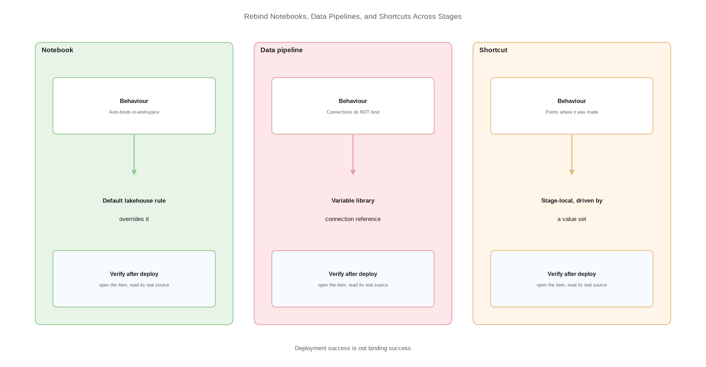

# Rebind Notebooks, Data Pipelines, and Shortcuts Across Stages

> Three item types, three different binding behaviours, three fixes.

*Series: Environment promotion · Layer: Promotion (5 of 5) · Audience: Fabric admins, platform engineers, and analytics developers · Level 300*

Semantic models get the attention, but notebooks, data pipelines, and shortcuts each carry their own binding behaviour. Notebooks auto-bind within a workspace, pipelines carry connection references that do not, and shortcuts point at wherever they were created. This entry handles all three.

## Scenario — when to use this

A promoted notebook is writing to the development lakehouse, a data pipeline is using a development connection, or a shortcut in the target workspace still resolves to a source-stage path. The deployment reported success in every case.

Work through this after entry 08 has told you which of your items need attention, and alongside entries 11 and 13 which provide the two mechanisms.

For more detail on the per-item behaviour, see:

- [Notebook source control and deployment — Microsoft Learn](https://learn.microsoft.com/en-us/fabric/data-engineering/notebook-source-control-deployment)
- [CI/CD for data pipelines in Data Factory — Microsoft Learn](https://learn.microsoft.com/en-us/fabric/data-factory/cicd-pipelines)

## What you'll set up

- Default lakehouse deployment rules for notebooks that need a specific target lakehouse.
- Variable-library-driven connections for data pipelines.
- A deliberate approach to shortcuts across stages.
- The **Lakehouse Auto-Binding in Git** setting turned on where you rely on it.



*Figure 15 — Notebooks, data pipelines, and shortcuts each bind differently on promotion; each has its own remediation.*

## Prerequisites

- A deployment pipeline with stages assigned (entry 12), or Git-based promotion in place.
- Item **ownership** of the notebooks you will write rules for.
- A variable library in the workspace if you will parameterise pipeline connections (entry 11).
- The target-stage lakehouse IDs — available from the lakehouse item URL.

## Step 1 — Notebooks: understand the auto-binding first

Notebook deployment **supports auto-binding** for the default lakehouse and attached environment when the dependent items are in the same workspace. During deployment, Fabric rebinds those dependencies to the corresponding items in the target workspace. You only need a rule when you want a **different** target lakehouse than auto-binding would choose.

1. Deploy the notebook and its lakehouse together and check the result first.
2. If the default lakehouse in the target stage is correct, you are done — do not add a rule.
3. If you need a specific lakehouse, continue to Step 2.

> **Note** — For Git specifically, notebook-to-lakehouse binding is **not enabled by default**. Turn on **Lakehouse Auto-Binding in Git** in the notebook settings if you depend on it during Git-based promotion.

## Step 2 — Notebooks: add a default lakehouse rule

1. Open the deployment pipeline and select the **target** stage — Test or Production, never Development.
2. Select **Deployment rules** on the notebook.
3. In the **Set deployment rules** pane, select the **Default lakehouse** tile.
4. Use the **From** and **To** dropdowns to map the source-stage default lakehouse to the target-stage one. **To** offers *Same with source lakehouse*, *N/A (no default lakehouse)*, or *Other*.
5. If you choose **Other**, supply the **Lakehouse ID**, **Lakehouse name**, and **Lakehouse workspace ID**. The Lakehouse ID is required — take it from the item URL.
6. Save and redeploy.

> **Note** — **Deployment rules take priority over auto-binding.** If a rule is configured, it overrides the auto-bound lakehouse — so a stale rule will defeat correct auto-binding.

## Step 3 — Data pipelines: parameterise the connections

Connection references — data source connections and gateways — do **not** auto-bind. Use variable libraries with environment-specific value sets to manage them across environments.

1. Create a variable of type **Connection reference** or **Item reference** in your variable library (entry 11).
2. In the data pipeline, reference it through **Add dynamic content** → **Library variables**.
3. Append a `.` to reach the properties you need — connection ID, item ID, or item workspace.
4. Set the correct value in each stage's value set, and set the active value set per pipeline stage.

```
@pipeline().libraryVariables.BronzeConnection.connectionId
```

## Step 4 — Shortcuts: decide the pattern deliberately

A shortcut resolves to the path it was created against. Choose one of two approaches and apply it consistently:

- **Stage-local shortcuts** — each stage has its own shortcut to its own source. Parameterise the target with a variable library value set so the shortcut definition promotes cleanly.
- **Shared upstream source** — every stage shortcuts to the same curated source. Simpler, but a change at the source reaches production immediately, so the source itself must be governed as production.

> **Tip** — Lakehouse shortcuts are on the list of item types that can consume variable library values. That makes stage-local shortcuts genuinely maintainable — the shortcut definition is identical in every stage and only the value set differs.

## Secured environment — what changes

- Shortcuts to firewalled storage need **trusted workspace access**, which requires an **F SKU** capacity and a **workspace identity** with Contributor access to the workspace. Identities are per workspace, so each stage needs its own.
- Trusted workspace access only works when public access on the storage account is **disabled** or limited to selected networks — and resource instance rules for Fabric workspaces must be created through **ARM templates or PowerShell**, not the Azure portal.
- Data pipelines **cannot write** to OneLake table shortcuts on storage accounts using trusted workspace access — verify your write paths before designing around it.
- For Spark access to protected storage, use **managed private endpoints** rather than trusted workspace access. Managed private endpoints support notebooks, lakehouses, and Spark job definitions.
- If your organisation has a Conditional Access policy for workload identities that includes **all** service principals, trusted workspace access will not work.

## Validate

- Open the promoted notebook in the target stage — the default lakehouse is the target-stage lakehouse.
- Run the notebook and confirm it writes to the target-stage location.
- Trigger the data pipeline and confirm it uses the target-stage connection.
- Open a shortcut in the target stage and confirm the resolved path is correct for that stage.

## Limitations & gotchas

- Notebook auto-binding covers **same-workspace** dependencies only.
- A known issue: **frozen cell status in notebooks is not preserved** during deployment.
- The **Environment Resources** folder is not currently supported by deployment pipelines or the public APIs.
- Commits are capped at **50 MB**, so use `.gitignore` or Git rules to exclude large or temporary notebook outputs.
- Pre-existing shortcuts created before **October 10, 2023** do not support trusted workspace access.
- A maximum of **200 resource instance rules** can be configured on a storage account.

## Rollback

1. Delete the default lakehouse rule from the target stage and redeploy to restore auto-binding.
2. Revert a pipeline to literal connection values by replacing the dynamic content before removing the variable.
3. Re-create a shortcut against the intended path; shortcut definitions are cheap to rebuild and safe to delete.

## References

- [Notebook source control and deployment — Microsoft Learn](https://learn.microsoft.com/en-us/fabric/data-engineering/notebook-source-control-deployment)
- [CI/CD for data pipelines in Data Factory — Microsoft Learn](https://learn.microsoft.com/en-us/fabric/data-factory/cicd-pipelines)
- [Variable library integration with data pipelines — Microsoft Learn](https://learn.microsoft.com/en-us/fabric/data-factory/variable-library-integration-with-data-pipelines)
- [Trusted workspace access — Microsoft Learn](https://learn.microsoft.com/en-us/fabric/security/security-trusted-workspace-access)
- [Managed private endpoints overview — Microsoft Learn](https://learn.microsoft.com/en-us/fabric/security/security-managed-private-endpoints-overview)
