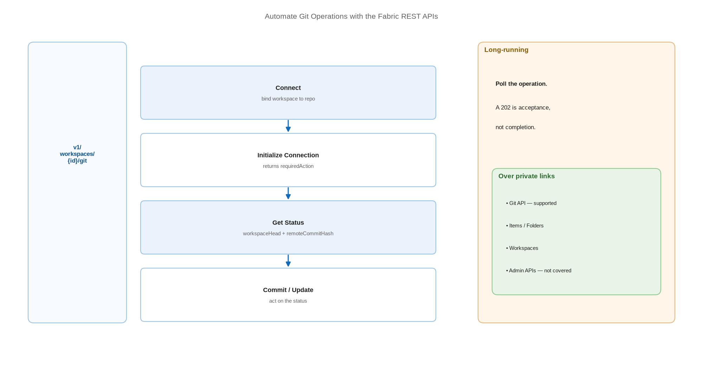

# Automate Git Operations with the Fabric REST APIs

> Connect, commit, and update workspaces from code instead of the Source control panel.

*Series: Release automation · Layer: APIs (1 of 5) · Audience: Fabric admins, platform engineers, and analytics developers · Level 300*

Everything the Source control panel does is available as a REST call. Once Git operations are scriptable you can provision workspaces on demand, sync them as part of a build, and stop depending on someone remembering to press a button. This entry covers the Git API surface and the sequence that actually works.

## Scenario — when to use this

You want a developer workspace created and connected automatically when a feature branch is opened, or a nightly job that verifies every workspace matches its branch. Doing this by hand does not scale past a handful of workspaces.

Start here before building a full release pipeline (entries 19-20) — those tools sit on top of these APIs, and understanding the primitives makes their failures legible.

For more detail on how this works, see:

- [Automate Git integration with APIs — Microsoft Learn](https://learn.microsoft.com/en-us/fabric/cicd/git-integration/git-automation)
- [Git — Fabric REST API (Core) — Microsoft Learn](https://learn.microsoft.com/en-us/rest/api/fabric/core/git)

## What you'll set up

- An authenticated caller — a user token for exploration, a service principal for automation.
- The **connect → initialize → commit / update** sequence.
- Status polling so your automation reacts to real state rather than assuming success.
- A repeatable script you can call from any build system.



*Figure 16 — The Git REST API sequence: connect the workspace, initialize the connection, then commit or update based on the reported status.*

## Prerequisites

- Git integration enabled at tenant level (entry 01).
- An identity that can call Fabric APIs — see entry 21 for service principals.
- The tenant setting permitting service principals to call Fabric APIs, if automating.
- The workspace ID, and the Git provider details for the target repository.

## Step 1 — Know the operations

| Operation | What it does |
| --- | --- |
| **Connect** | Binds a workspace to a repository, branch, and directory |
| **Initialize Connection** | Performs the first sync and reports the required direction |
| **Get Connection** | Returns the current Git connection details for a workspace |
| **Get Status** | Returns per-item sync state and the remote commit hash |
| **Commit To Git** | Writes workspace changes to the connected branch |
| **Update From Git** | Applies branch content to the workspace |

> **Note** — The item-type enumeration returned by **Get Status** is longer than the list of item types Git integration actually supports. Do not treat the API enum as the supported-items list.

## Step 2 — Connect and initialize

Connect binds the workspace; Initialize Connection performs the first sync and tells you which direction is required. Always call them in that order.

```
# 1. Connect the workspace to the repository
POST https://api.fabric.microsoft.com/v1/workspaces/{workspaceId}/git/connect

{
  "gitProviderDetails": {
    "gitProviderType": "AzureDevOps",
    "organizationName": "{organization}",
    "projectName": "{project}",
    "repositoryName": "{repository}",
    "branchName": "{branch}",
    "directoryName": "{folder}"
  }
}

# 2. Initialize — returns requiredAction: None | CommitToGit | UpdateFromGit
POST https://api.fabric.microsoft.com/v1/workspaces/{workspaceId}/git/initializeConnection
```

> **Note** — Initialize Connection returns a **requiredAction**. Branch on it rather than assuming a direction — that value is exactly the "which side is authoritative" decision from entry 02, surfaced programmatically.

## Step 3 — Read status before acting

```
GET https://api.fabric.microsoft.com/v1/workspaces/{workspaceId}/git/status

# Returns per-item changes plus:
#   workspaceHead   - the commit the workspace is synced to
#   remoteCommitHash - the current head of the connected branch
# Both are required inputs to commit and update.
```

## Step 4 — Commit and update

```
# Commit — mode "All" or "Selective"
POST https://api.fabric.microsoft.com/v1/workspaces/{workspaceId}/git/commitToGit
{
  "mode": "All",
  "workspaceHead": "{workspaceHead}",
  "comment": "Automated commit from build 1234"
}

# Update — conflict policy must be stated explicitly
POST https://api.fabric.microsoft.com/v1/workspaces/{workspaceId}/git/updateFromGit
{
  "workspaceHead": "{workspaceHead}",
  "remoteCommitHash": "{remoteCommitHash}",
  "conflictResolution": {
    "conflictResolutionType": "Workspace",
    "conflictResolutionPolicy": "PreferRemote"
  }
}
```

> **Tip** — These are long-running operations. Poll the operation status rather than treating a 202 as success — a build that reports green on an accepted-but-unfinished deployment is worse than one that fails.

## Secured environment — what changes

- The **Git REST API is supported over workspace-level private links**, alongside Items, Folders, Job Scheduler, OneLake Shortcuts, Managed Private Endpoints, Tags, and Workspaces.
- Core APIs scoped as `v1/workspaces/{workspaceId}` work over workspace private links because they operate in a workspace context. **Admin APIs** using `admin/workspaces/{workspaceId}` are **not** covered and remain governed by the tenant-level public-access setting.
- Your agent must resolve the workspace-specific FQDN, not the generic endpoint. Get the format wrong and it resolves to the wrong address and the connection fails (entry 22).
- Grant the automation identity the narrowest scope that works. Git-specific delegated scope is `Workspace.GitUpdate.All`; generic item scopes are `Item.Read.All` and `Item.ReadWrite.All`.
- Scopes apply to **delegated** access on behalf of users. Direct access by service principals and managed identities is governed by Fabric admin controls and item permissions instead.

## Validate

- Get Connection returns the expected repository, branch, and directory.
- Get Status reflects a change you make in the portal.
- A scripted commit appears in the branch history with the automation identity as author.
- A scripted update brings a branch change into the workspace.
- Running the script twice with no changes is a clean no-op.

## Limitations & gotchas

- Commit and update cannot run simultaneously — one direction at a time.
- Commit size ceilings apply to API calls too: **25 MB** for Azure DevOps via service principal, **125 MB** via user SSO, **50 MB** combined for GitHub.
- The API schema states `branchName` maxLength **250** and `directoryName` maxLength **256**, while the product documentation quotes **244** and **250**. Design to the smaller numbers.
- Sovereign clouds are not supported.
- Only a workspace **Admin** can connect or disconnect, so your automation identity needs Admin, not Member.
- From **December 1, 2026**, identities without read-write permissions on workspace items cannot use Git integration.

## Rollback

1. To undo a scripted commit, revert it in the Git provider and call Update From Git.
2. To undo a scripted update, commit the workspace state back, or restore from an earlier commit and update again.
3. To detach entirely, call the Git disconnect operation, or disconnect from workspace settings.

## References

- [Automate Git integration with APIs — Microsoft Learn](https://learn.microsoft.com/en-us/fabric/cicd/git-integration/git-automation)
- [Git — Fabric REST API (Core) — Microsoft Learn](https://learn.microsoft.com/en-us/rest/api/fabric/core/git)
- [Git - Connect — Fabric REST API — Microsoft Learn](https://learn.microsoft.com/en-us/rest/api/fabric/core/git/connect)
- [Git - Initialize Connection — Fabric REST API — Microsoft Learn](https://learn.microsoft.com/en-us/rest/api/fabric/core/git/initialize-connection)
- [Git - Get Status — Fabric REST API — Microsoft Learn](https://learn.microsoft.com/en-us/rest/api/fabric/core/git/get-status)
- [Git - Commit To Git — Fabric REST API — Microsoft Learn](https://learn.microsoft.com/en-us/rest/api/fabric/core/git/commit-to-git)
- [Git - Update From Git — Fabric REST API — Microsoft Learn](https://learn.microsoft.com/en-us/rest/api/fabric/core/git/update-from-git)
