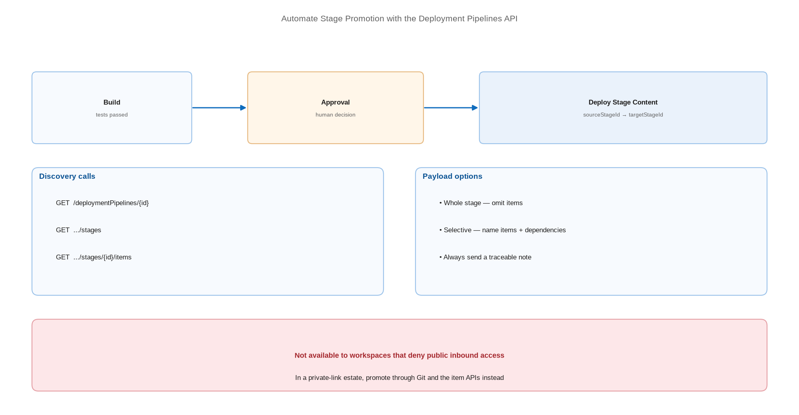

# Automate Stage Promotion with the Deployment Pipelines API

> Trigger promotions from a build instead of a browser, with notes and selective payloads.

*Series: Release automation · Layer: APIs (2 of 5) · Audience: Fabric admins, platform engineers, and analytics developers · Level 300*

If deployment pipelines are your promotion mechanism (entry 12), the REST API is what turns them into a release process. Promotion becomes something a build triggers after tests pass and an approver signs off — not something a person does by hand on a Friday afternoon.

## Scenario — when to use this

Your deployment pipeline works but promotion is manual, unlogged beyond the pipeline history, and dependent on one person being available. You need it triggered by your build system, gated by an approval, and recorded in your release tooling.

Use this when deployment pipelines are viable for your estate. Where workspaces deny public inbound access, pipelines are unavailable — see the secured-environment section and entry 22.

For more detail on how this works, see:

- [Automate deployment pipelines with Fabric APIs — Microsoft Learn](https://learn.microsoft.com/en-us/fabric/cicd/deployment-pipelines/pipeline-automation-fabric)
- [Deployment Pipelines — Fabric REST API (Core) — Microsoft Learn](https://learn.microsoft.com/en-us/rest/api/fabric/core/deployment-pipelines)

## What you'll set up

- An authenticated caller with access to the pipeline and its workspaces.
- Discovery calls that resolve stage and item identifiers at run time.
- A **Deploy Stage Content** call, whole-stage or selective.
- Operation polling and a failure path that stops the release.



*Figure 17 — A build triggers stage promotion through the API: discover stages, resolve items, deploy, then poll the long-running operation to completion.*

## Prerequisites

- A working deployment pipeline with workspaces assigned (entry 12).
- An identity with access to the pipeline and admin rights on the workspaces.
- Deployment rules already configured on target stages (entries 13-15).
- The tenant setting permitting service principals to call Fabric APIs.

## Step 1 — Discover the pipeline and its stages

```
GET https://api.fabric.microsoft.com/v1/deploymentPipelines/{pipelineId}
GET https://api.fabric.microsoft.com/v1/deploymentPipelines/{pipelineId}/stages
GET https://api.fabric.microsoft.com/v1/deploymentPipelines/{pipelineId}/stages/{stageId}/items
```

> **Note** — The operations are **List** Deployment Pipeline Stages and **List** Deployment Pipeline Stage Items. Resolve stage and item IDs at run time rather than hard-coding them — they change when a pipeline is edited.

## Step 2 — Deploy the whole stage

```
POST https://api.fabric.microsoft.com/v1/deploymentPipelines/{pipelineId}/deploy

{
  "sourceStageId": "{devStageId}",
  "targetStageId": "{testStageId}",
  "note": "Release 2026.08.24 - build 1234"
}
```

> **Tip** — Always send a **note** and make it traceable — a build number, a change ticket, a commit hash. Deployment history is the record you will be asked for when someone wants to know what changed and why.

## Step 3 — Deploy selectively

To promote a subset, name the items explicitly. Include every dependency — a promoted item whose dependency stays behind binds to the source stage (entry 08).

```
POST https://api.fabric.microsoft.com/v1/deploymentPipelines/{pipelineId}/deploy

{
  "sourceStageId": "{devStageId}",
  "targetStageId": "{testStageId}",
  "items": [
    { "sourceItemId": "{itemId}", "itemType": "Notebook" },
    { "sourceItemId": "{itemId}", "itemType": "SemanticModel" }
  ],
  "note": "Hotfix - pricing notebook and model only"
}
```

## Step 4 — Poll to completion and fail loudly

1. The deploy call returns a long-running operation. Capture the operation identifier.
2. Poll until the operation reports success or failure.
3. On failure, surface the error and **stop the release** — do not proceed to the next stage.
4. On success, run your binding verification checks (entries 08 and 14) before declaring the release good.

## Secured environment — what changes

- **Deployment pipelines cannot connect to a workspace that denies public access**, and inbound restriction is blocked for any workspace assigned to a pipeline. In a private-link estate this API is not available to you — promote through Git and the item APIs instead (entries 16, 19, 20).
- Restrict who and what may call deploy against the production stage. This is the single API call that changes what users see.
- Run promotion as a **service principal** with credentials from a secret store, never a personal token (entries 21 and 24).
- Gate the call behind a pipeline **approval** so a human authorises production promotion even though a machine performs it (entry 24).
- Deployment rules are pipeline configuration and are not captured in Git — record them alongside your release documentation so the repository is not mistaken for a complete description of production.

## Validate

- The stage listing returns your stages in the expected order.
- A scripted deployment appears in the pipeline's deployment history with your note.
- A selective deployment moves only the named items.
- A deliberately invalid item ID produces a failure your build detects rather than swallows.

## Limitations & gotchas

- The API deploys **definitions**, not data — the same rule as the portal.
- Selective deployment without dependencies produces items bound to the source stage.
- There is **no rollback operation**. Reverting means deploying a known-good version forward.
- A workspace can be assigned to only one stage of one pipeline at a time.
- From **February 12, 2026**, semantic models not upgraded to Enhanced Metadata are no longer supported.

## Rollback

1. Restore the previous item definitions in the source stage from Git (entry 04).
2. Redeploy forward to the affected target stage.
3. Re-verify bindings before telling consumers the issue is resolved.

## References

- [Automate deployment pipelines with Fabric APIs — Microsoft Learn](https://learn.microsoft.com/en-us/fabric/cicd/deployment-pipelines/pipeline-automation-fabric)
- [Deployment Pipelines — Fabric REST API (Core) — Microsoft Learn](https://learn.microsoft.com/en-us/rest/api/fabric/core/deployment-pipelines)
- [Deploy Stage Content — Fabric REST API — Microsoft Learn](https://learn.microsoft.com/en-us/rest/api/fabric/core/deployment-pipelines/deploy-stage-content)
- [List Deployment Pipeline Stages — Fabric REST API — Microsoft Learn](https://learn.microsoft.com/en-us/rest/api/fabric/core/deployment-pipelines/list-deployment-pipeline-stages)
- [List Deployment Pipeline Stage Items — Fabric REST API — Microsoft Learn](https://learn.microsoft.com/en-us/rest/api/fabric/core/deployment-pipelines/list-deployment-pipeline-stage-items)
- [Understand the deployment process — Microsoft Learn](https://learn.microsoft.com/en-us/fabric/cicd/deployment-pipelines/understand-the-deployment-process)
