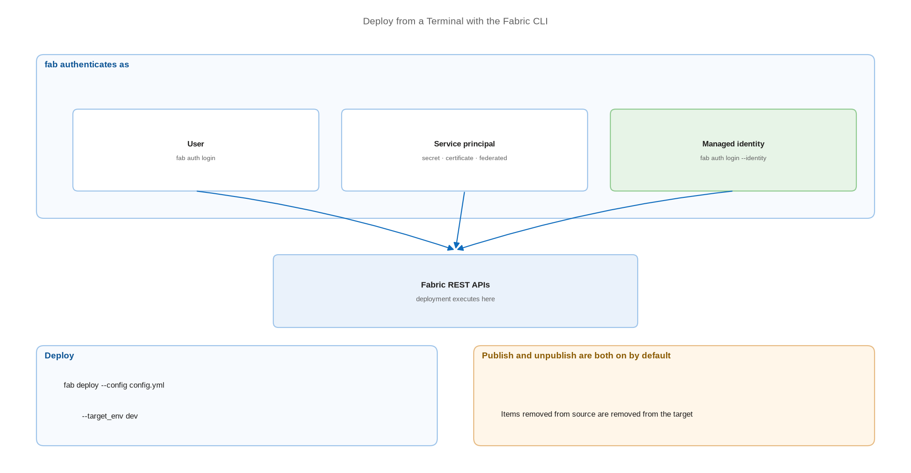

# Deploy from a Terminal with the Fabric CLI

> One command-line tool for exploration, scripted deployment, and agent-based release.

*Series: Release automation · Layer: Tooling (3 of 5) · Audience: Fabric admins, platform engineers, and analytics developers · Level 300*

The Fabric CLI (`fab`) puts the Fabric REST APIs behind a command line. It is the fastest way to explore a tenant, the simplest way to script a deployment, and — because it authenticates as a user, a service principal, or a managed identity — it runs equally well on a laptop and on a build agent.

## Scenario — when to use this

You want to deploy without writing API plumbing, or you need a quick way to inspect what is actually in a workspace during an incident. Building a REST client for a two-minute question is disproportionate.

Use the CLI for scripted deployment and interactive work. Use `fabric-cicd` directly (entries 19-20) when you need fine-grained control inside a Python-based release pipeline — the CLI's `deploy` command runs `fabric-cicd` underneath.

For more detail on how this works, see:

- [Fabric command line interface — Microsoft Learn](https://learn.microsoft.com/en-us/rest/api/fabric/articles/fabric-command-line-interface)
- [Microsoft Fabric CLI documentation](https://microsoft.github.io/fabric-cli/)

## What you'll set up

- The CLI installed and authenticated.
- A `config.yml` describing what deploys where.
- A scripted `fab deploy` you can call from any build system.
- An authentication method appropriate to where the command runs.



*Figure 18 — The Fabric CLI authenticates as a user, service principal, or managed identity and drives deployment through the Fabric REST APIs.*

## Prerequisites

- **Python 3.10 or higher** (3.10-3.13 supported).
- A Fabric tenant and a workspace you can write to.
- For service principal or managed identity sign-in, the tenant setting permitting service principals to call Fabric APIs.
- Network egress to PyPI, or an internal package mirror (see the secured section).

## Step 1 — Install

```
pip install ms-fabric-cli

# confirm
fab --version
```

> **Note** — The PyPI package is **`ms-fabric-cli`**; the command it installs is **`fab`**. Installing a package named `fabric-cli` gets you something else entirely.

## Step 2 — Authenticate

The CLI supports user, service principal, and managed identity sign-in:

```
# Interactive, for local work
fab auth login

# Service principal with a secret
fab auth login -u <client_id> -p <client_secret> --tenant <tenant_id>

# Service principal with a certificate
fab auth login -u <client_id> --certificate </path/to/cert.pem> --tenant <tenant_id>

# Federated token (OIDC / workload identity federation - secretless)
fab auth login -u <client_id> --federated-token <token> --tenant <tenant_id>

# Managed identity, system-assigned
fab auth login --identity

# Managed identity, user-assigned
fab auth login --identity -u <client_id>

fab auth status
fab auth logout
```

## Step 3 — Deploy

```
fab deploy --config <config_file> [--target_env <environment>] [--params <parameters>] [--force]

# typical usage
fab deploy --config config.yml --target_env dev
```

Deployment to the Fabric workspaces is executed via the Fabric REST APIs. By default, **both publish and unpublish operations are enabled and executed** — so items removed from source are removed from the target.

> **Note** — `--bulk_publish` is **experimental**: it uses the underlying `fabric-cicd` bulk import (beta) API and may change or fail. Keep it out of production releases until it stabilises.

## Step 4 — Know the other useful commands

| Command | Purpose |
| --- | --- |
| `fab export` | Export a single item |
| `fab import` | Import an item (create or modify) |
| `fab bulk-export` | Export a folder or workspace in bulk |
| `fab api` | Call an arbitrary Fabric REST endpoint |
| `fab acls` | Inspect and manage access |
| `fab job` | Run and monitor jobs |
| `fab label` | Work with sensitivity labels |

> **Tip** — `fab export` handles **one item at a time and does not include logical IDs**. Items exported that way and then deployed will reference the *original* item unless you parameterise — prefer content committed through Git integration as your deployment source.

## Secured environment — what changes

- Managed identity sign-in is the strongest option on a build agent: no secret exists to leak. Note it is **currently tested and validated only on Azure Virtual Machine resources**.
- Federated token sign-in gives you secretless authentication from GitHub Actions or Azure DevOps with workload identity federation (entry 21).
- A locked-down agent needs egress to **PyPI** to install the CLI, or an internal mirror. `https://pypi.org/*` appears on Microsoft's own required-URL list for Private Link environments — plan for it rather than discovering it at build time.
- Behind workspace-level private links, the agent must resolve the workspace-specific FQDN. See entry 22 for the format and entry 23 for agent placement.
- Service principal and managed identity sign-in both depend on the tenant setting permitting service principals to call Fabric APIs. Confirm it before scripting anything.

## Validate

- `fab --version` returns a version.
- `fab auth status` shows the expected identity and tenant.
- A deploy to a disposable workspace creates the expected items.
- Re-running the deploy with no source changes is idempotent.
- Removing an item from source and redeploying removes it from the target — confirming unpublish behaviour is what you expect.

## Limitations & gotchas

- Selective deployment is supported but **not recommended**, because of potential dependency-management issues.
- `fab export` does not include logical IDs; parameterise or deploy from Git-committed content.
- `--bulk_publish` is experimental.
- Deployment runs in the tenant of the executing identity.
- Deployments can fail with **429 Too Many Requests** — deploy in smaller batches if you hit rate limits.

## Rollback

1. Check out the previous commit of your source directory and re-run `fab deploy`.
2. Because unpublish is enabled by default, ensure the previous commit still contains every item you intend to keep.
3. For a single item, use `fab import` to restore a known-good definition.

## References

- [Fabric command line interface — Microsoft Learn](https://learn.microsoft.com/en-us/rest/api/fabric/articles/fabric-command-line-interface)
- [Microsoft Fabric CLI documentation](https://microsoft.github.io/fabric-cli/)
- [Fabric CLI — command reference](https://microsoft.github.io/fabric-cli/commands/)
- [Fabric CLI — the deploy command](https://microsoft.github.io/fabric-cli/commands/fs/deploy/)
- [Fabric CLI — authentication examples](https://microsoft.github.io/fabric-cli/examples/auth_examples/)
- [microsoft/fabric-cli — GitHub](https://github.com/microsoft/fabric-cli)
