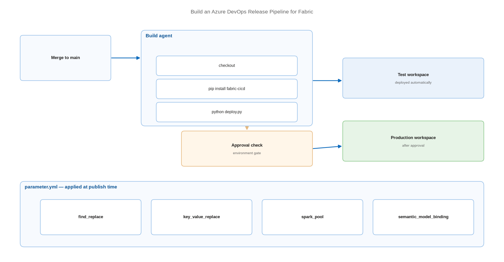

# Build an Azure DevOps Release Pipeline for Fabric

> A YAML pipeline that deploys Fabric items with fabric-cicd, gated by environments and approvals.

*Series: Release automation · Layer: Pipelines (4 of 5) · Audience: Fabric admins, platform engineers, and analytics developers · Level 300*

This is where the series comes together: source control from Layer 1, isolation from Layer 2, parameterisation from Layer 3, and the APIs from entries 16-18, assembled into a release pipeline that promotes Fabric content on a merge and stops for approval before production.

## Scenario — when to use this

Content is in Git and promotion works manually, but releases still depend on someone running commands. You want a merge to `main` to deploy to test automatically, and a production deployment that waits for an approver.

Use Azure DevOps when your organisation already runs it, or when you need Fabric to authenticate to the repository as a service principal — Azure DevOps is the only provider where that is supported.

For more detail on the documented approach, see:

- [Tutorial: CI/CD for Fabric using Azure DevOps and fabric-cicd — Microsoft Learn](https://learn.microsoft.com/en-us/fabric/cicd/tutorial-fabric-cicd-azure-devops)
- [fabric-cicd — documentation](https://microsoft.github.io/fabric-cicd/latest/)

## What you'll set up

- A `parameter.yml` that maps environment-specific values per stage.
- A YAML pipeline that installs `fabric-cicd` and publishes items.
- Azure DevOps **environments** with approval checks before production.
- Secretless authentication through workload identity federation.



*Figure 19 — Merge to main triggers a build; the pipeline deploys to test automatically and pauses for approval before deploying to production.*

## Prerequisites

- A repository holding content committed through Fabric Git integration (entry 02).
- An Entra service principal with access to the target workspaces (entry 21).
- The tenant setting permitting service principals to call Fabric APIs.
- Python **3.9-3.13** available on the agent.
- Workspace IDs for each stage.

## Step 1 — Write parameter.yml

`parameter.yml` sits in the root of the `repository_directory` you point `fabric-cicd` at. It supports four parameter types — `find_replace`, `key_value_replace`, `spark_pool`, and `semantic_model_binding`:

```
find_replace:
  - find_value: "https://dev-endpoint.datawarehouse.fabric.microsoft.com"
    replace_value:
      TEST: "https://test-endpoint.datawarehouse.fabric.microsoft.com"
      PROD: "https://prod-endpoint.datawarehouse.fabric.microsoft.com"
    item_type: "SemanticModel"

  - find_value: "$workspace.$id"
    replace_value:
      TEST: "$workspace.Finance Reporting [TEST].$id"
      PROD: "$workspace.Finance Reporting [PROD].$id"
```

> **Tip** — The `find_replace` block is what finally removes the Direct Lake problem from entry 14 in a Git-based flow: replace the development SQL endpoint with the target-stage endpoint at publish time, and the deployed model is bound correctly before anyone opens it.

## Step 2 — Write the deployment script

```
from azure.identity import ClientSecretCredential
from fabric_cicd import FabricWorkspace, publish_all_items, unpublish_all_orphan_items
import os

credential = ClientSecretCredential(
    tenant_id=os.environ["AZURE_TENANT_ID"],
    client_id=os.environ["AZURE_CLIENT_ID"],
    client_secret=os.environ["AZURE_CLIENT_SECRET"],
)

workspace = FabricWorkspace(
    workspace_id=os.environ["FABRIC_WORKSPACE_ID"],
    environment=os.environ["TARGET_ENVIRONMENT"],      # must match a parameter.yml key
    repository_directory="./workspace",
    item_type_in_scope=["Notebook", "DataPipeline", "SemanticModel", "VariableLibrary"],
    token_credential=credential,
)

publish_all_items(workspace)
unpublish_all_orphan_items(workspace)
```

> **Note** — All `FabricWorkspace` parameters must be passed as **keyword arguments**, and `token_credential` is **required** — the default-credential fallback and implicit notebook authentication are no longer supported.

## Step 3 — Write the YAML pipeline

```
trigger:
  branches: { include: [ main ] }

pool: { vmImage: ubuntu-latest }

stages:
- stage: Test
  jobs:
  - deployment: DeployTest
    environment: fabric-test
    strategy:
      runOnce:
        deploy:
          steps:
          - checkout: self
          - task: UsePythonVersion@0
            inputs: { versionSpec: '3.11' }
          - script: pip install fabric-cicd
            displayName: Install fabric-cicd
          - script: python deploy.py
            displayName: Deploy to Test
            env:
              TARGET_ENVIRONMENT: TEST
              FABRIC_WORKSPACE_ID: $(TestWorkspaceId)
              AZURE_TENANT_ID: $(AzureTenantId)
              AZURE_CLIENT_ID: $(AzureClientId)
              AZURE_CLIENT_SECRET: $(AzureClientSecret)

- stage: Production
  dependsOn: Test
  jobs:
  - deployment: DeployProd
    environment: fabric-production      # approval check configured here
    strategy:
      runOnce:
        deploy:
          steps:
          - checkout: self
          - task: UsePythonVersion@0
            inputs: { versionSpec: '3.11' }
          - script: pip install fabric-cicd
          - script: python deploy.py
            env:
              TARGET_ENVIRONMENT: PROD
              FABRIC_WORKSPACE_ID: $(ProdWorkspaceId)
              AZURE_TENANT_ID: $(AzureTenantId)
              AZURE_CLIENT_ID: $(AzureClientId)
              AZURE_CLIENT_SECRET: $(AzureClientSecret)
```

## Step 4 — Gate production with an approval

1. Go to **Pipelines** → **Environments** and open `fabric-production`.
2. Select the **Approvals and checks** tab, then **+** to add a check.
3. Select **Approvals**, then **Next**.
4. Add the approvers, restrict approvers from approving their own runs, and set a **Timeout**.
5. Select **Create**. The Production stage now pauses until an approver responds.

> **Tip** — Add a **Branch control** check as well, restricting deployment to `refs/heads/main` with branch protection required. Approvals stop the wrong *time*; branch control stops the wrong *content*.

## Secured environment — what changes

- Replace the client secret with **workload identity federation**: use `WorkloadIdentityCredential` for secretless authentication with federated credentials. No secret in the pipeline is a secret that cannot leak (entry 21).
- On self-hosted agents with a system-assigned managed identity, use `ManagedIdentityCredential` — this is the documented option for Azure DevOps self-hosted agents and agents on Azure VMs (entry 23).
- Where target workspaces sit behind workspace-level private links, call `configure_fabric_fqdn(workspace_id)` **before** constructing `FabricWorkspace`, or API calls fail with connection errors (entry 22).
- Store any secret that genuinely must exist in **Azure Key Vault** and read it as a pipeline variable rather than committing it (entry 24).
- The agent needs egress to PyPI or an internal mirror to install `fabric-cicd` — pre-bake it into a container image if egress is not permitted.

## Validate

- A merge to `main` triggers the pipeline automatically.
- The Test stage completes and the items appear in the test workspace.
- The Production stage **pauses** for approval and does not proceed until approved.
- Post-deployment, bindings resolve to the correct stage (entries 08 and 14).
- A deliberately broken `parameter.yml` fails the build rather than deploying wrong values.

## Limitations & gotchas

- `fabric-cicd` performs a **full deployment every time**, without considering commit diffs.
- It deploys into the tenant of the **executing identity**, and supports only items with source control and public create/update APIs.
- The `repository_directory` must contain only Git-integration-committed items, plus `parameter.yml`.
- Dynamic variables (`$workspace`, `$items`) are **not supported in bulk publish mode**; their presence makes the deployment fall back to standard publishing.
- Whenever any dynamic variable is used, `$sqlendpoint` is resolved eagerly for **every** lakehouse, mirrored database, warehouse, and SQL database in the target workspace — if any endpoint is still provisioning, the deployment fails before publishing anything.
- You are solely responsible for regex validity in `find_replace`; an invalid or non-matching pattern fails the deployment.
- When deleting and recreating an item with the same name, wait **five minutes** between operations because of Fabric API item name reservation.

## Rollback

1. Re-run the pipeline against the previous commit.
2. Because `unpublish_all_orphan_items` removes items absent from source, confirm the earlier commit contains everything production should keep.
3. For an urgent fix, deploy the known-good commit to production directly and reconcile `main` afterwards.

## References

- [Tutorial: CI/CD for Fabric using Azure DevOps and fabric-cicd — Microsoft Learn](https://learn.microsoft.com/en-us/fabric/cicd/tutorial-fabric-cicd-azure-devops)
- [fabric-cicd — documentation](https://microsoft.github.io/fabric-cicd/latest/)
- [fabric-cicd — parameterization](https://microsoft.github.io/fabric-cicd/latest/how_to/parameterization/)
- [fabric-cicd — authentication](https://microsoft.github.io/fabric-cicd/latest/example/authentication/)
- [Create and target Azure DevOps environments for pipelines — Microsoft Learn](https://learn.microsoft.com/en-us/azure/devops/pipelines/process/environments)
- [Define approvals and checks — Microsoft Learn](https://learn.microsoft.com/en-us/azure/devops/pipelines/process/approvals)
