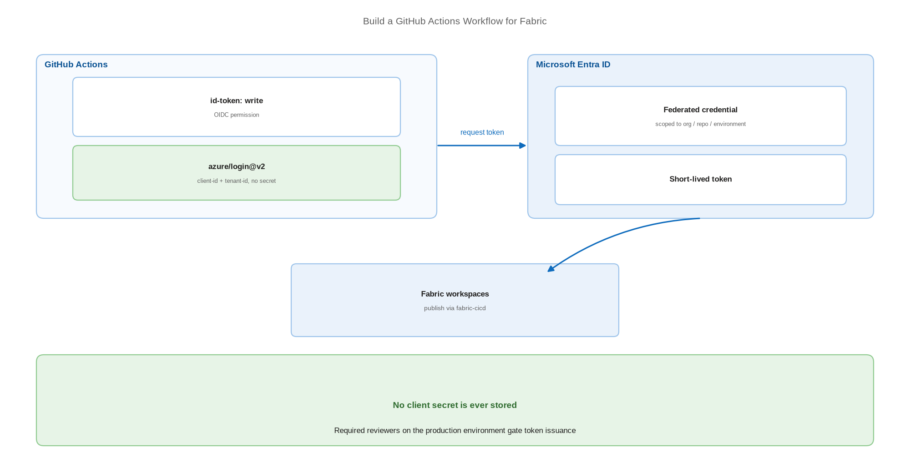

# Build a GitHub Actions Workflow for Fabric

> The same release process on GitHub, with OIDC instead of stored secrets.

*Series: Release automation · Layer: Pipelines (5 of 5) · Audience: Fabric admins, platform engineers, and analytics developers · Level 300*

The GitHub equivalent of entry 19, with one meaningful upgrade: GitHub Actions authenticates to Azure through OpenID Connect, so the workflow holds no secret at all. This entry builds the workflow and the environment protection around it.

## Scenario — when to use this

Your organisation standardises on GitHub and you want Fabric deployments triggered by pull request merges, gated by GitHub environments, and authenticated without storing a client secret in repository settings.

Choose GitHub when it is already your platform. Note that Fabric's GitHub support is **cloud only** — GitHub Enterprise Server is not supported, and Fabric cannot authenticate to GitHub as a service principal (entry 01).

For more detail on the mechanisms, see:

- [fabric-cicd — documentation](https://microsoft.github.io/fabric-cicd/latest/)
- [Configuring OpenID Connect in Azure — GitHub Docs](https://docs.github.com/en/actions/deployment/security-hardening-your-deployments/configuring-openid-connect-in-azure)

## What you'll set up

- A federated credential on the Entra app so GitHub can request tokens without a secret.
- GitHub **environments** with required reviewers before production.
- A workflow that installs `fabric-cicd` and publishes to the right workspace per environment.
- Branch protection so only reviewed content ever reaches the workflow.



*Figure 20 — GitHub Actions requests a short-lived token through OIDC, then publishes Fabric items; the production environment requires a reviewer.*

## Prerequisites

- A GitHub cloud repository holding Git-integration-committed content.
- An Entra app registration for the deployment identity (entry 21).
- The tenant setting permitting service principals to call Fabric APIs.
- Workspace access for the service principal in every target workspace.

## Step 1 — Configure workload identity federation

1. Open the Entra app registration → **Certificates & secrets** → **Federated credentials**.
2. Add a credential with GitHub Actions as the issuer.
3. Set the organisation, repository, and entity — a branch, an environment, or a pull request.
4. Save. GitHub can now request Azure tokens for that exact context, and nothing else.

> **Tip** — Scope the federated credential to the **environment** (`fabric-production`) rather than the branch. Combined with required reviewers on that environment, a token for production can only be issued after a human approves.

## Step 2 — Create GitHub environments

1. Open **Settings** → **Environments** → **New environment**, named `fabric-test`.
2. Repeat for `fabric-production`.
3. On `fabric-production`, add **Required reviewers**.
4. Add environment variables for each: the workspace ID and the target environment key from `parameter.yml`.

## Step 3 — Write the workflow

```
name: Deploy Fabric

on:
  push:
    branches: [ main ]

permissions:
  id-token: write        # required for OIDC
  contents: read

jobs:
  test:
    runs-on: ubuntu-latest
    environment: fabric-test
    steps:
      - uses: actions/checkout@v4
      - uses: actions/setup-python@v5
        with: { python-version: '3.11' }
      - run: pip install fabric-cicd
      - uses: azure/login@v2
        with:
          client-id: ${{ vars.AZURE_CLIENT_ID }}
          tenant-id: ${{ vars.AZURE_TENANT_ID }}
          allow-no-subscriptions: true
      - run: python deploy.py
        env:
          TARGET_ENVIRONMENT: TEST
          FABRIC_WORKSPACE_ID: ${{ vars.FABRIC_WORKSPACE_ID }}

  production:
    needs: test
    runs-on: ubuntu-latest
    environment: fabric-production      # required reviewers gate this job
    steps:
      - uses: actions/checkout@v4
      - uses: actions/setup-python@v5
        with: { python-version: '3.11' }
      - run: pip install fabric-cicd
      - uses: azure/login@v2
        with:
          client-id: ${{ vars.AZURE_CLIENT_ID }}
          tenant-id: ${{ vars.AZURE_TENANT_ID }}
          allow-no-subscriptions: true
      - run: python deploy.py
        env:
          TARGET_ENVIRONMENT: PROD
          FABRIC_WORKSPACE_ID: ${{ vars.FABRIC_WORKSPACE_ID }}
```

## Step 4 — Use the secretless credential in code

With OIDC configured, the deployment script uses a workload identity credential rather than a client secret:

```
from azure.identity import WorkloadIdentityCredential
from fabric_cicd import FabricWorkspace, publish_all_items
import os

credential = WorkloadIdentityCredential()

workspace = FabricWorkspace(
    workspace_id=os.environ["FABRIC_WORKSPACE_ID"],
    environment=os.environ["TARGET_ENVIRONMENT"],
    repository_directory="./workspace",
    item_type_in_scope=["Notebook", "DataPipeline", "SemanticModel", "VariableLibrary"],
    token_credential=credential,
)

publish_all_items(workspace)
```

> **Note** — `WorkloadIdentityCredential` is the documented secretless option for CI/CD pipelines using OIDC or workload identity federation, and is recommended for GitHub Actions and for Azure DevOps with federated credentials.

## Secured environment — what changes

- OIDC removes the stored secret entirely — the strongest default available for GitHub-based Fabric deployment. Prefer it over `ClientSecretCredential` in every case where it is possible.
- For private-link workspaces, GitHub-hosted runners cannot reach a private endpoint. Use **self-hosted runners** inside your network (entry 23) and call `configure_fabric_fqdn()` before deploying (entry 22).
- Enable **Require conversation resolution** and **Do not allow bypassing** on protected branches so the workflow only ever runs on reviewed content (entry 09).
- GitHub cannot enforce Fabric's cross-geo export switch. If data residency is a hard requirement, that gap belongs in your risk assessment (entry 01).
- Pin actions to a commit SHA rather than a moving tag, so a compromised upstream tag cannot alter your deployment.

## Validate

- A push to `main` triggers the workflow.
- The test job completes and items appear in the test workspace.
- The production job **waits** for a reviewer.
- No secret is stored in the repository — only variables.
- A workflow run from an unauthorised branch or environment fails to obtain a token.

## Limitations & gotchas

- Fabric supports **cloud GitHub only**. GitHub Enterprise Server — including publicly reachable instances, custom domains, and IP allow-lists — is not supported.
- The GitHub commit ceiling is **50 MB** combined per commit.
- Fabric cannot authenticate to GitHub as a service principal; only personal access tokens are supported for the repository connection.
- A GitHub Marketplace action for Fabric deployment exists but is not confirmed as Microsoft-owned — prefer installing `fabric-cicd` from PyPI, which is.
- All the `fabric-cicd` limitations from entry 19 apply equally here.

## Rollback

1. Re-run the workflow against the previous commit using **Re-run jobs** on that run.
2. Or revert the merge on `main`, which triggers a fresh deployment of the reverted state.
3. Confirm orphan-unpublish behaviour will not remove items the earlier commit lacks.

## References

- [fabric-cicd — documentation](https://microsoft.github.io/fabric-cicd/latest/)
- [fabric-cicd — release pipeline example](https://microsoft.github.io/fabric-cicd/latest/example/release_pipeline/)
- [Configuring OpenID Connect in Azure — GitHub Docs](https://docs.github.com/en/actions/deployment/security-hardening-your-deployments/configuring-openid-connect-in-azure)
- [Managing environments for deployment — GitHub Docs](https://docs.github.com/en/actions/deployment/targeting-different-environments/using-environments-for-deployment)
- [About protected branches — GitHub Docs](https://docs.github.com/en/repositories/configuring-branches-and-merges-in-your-repository/managing-protected-branches/about-protected-branches)
- [Workload identity federation — Microsoft Learn](https://learn.microsoft.com/en-us/entra/workload-id/workload-identity-federation)
