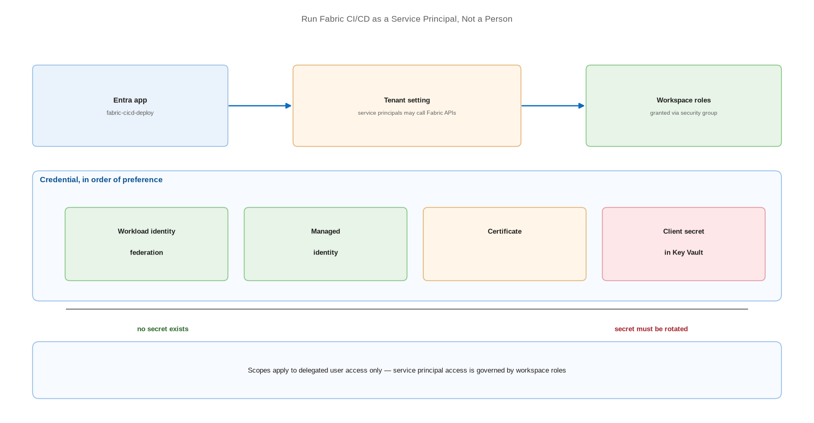

# Run Fabric CI/CD as a Service Principal, Not a Person

> Give automation its own identity, then remove the secret from it entirely.

*Series: Secured environment · Layer: Identity (1 of 5) · Audience: Fabric admins, platform engineers, and analytics developers · Level 300*

A release process that runs as a named person breaks when that person changes role, and it makes every deployment indistinguishable from manual work in the audit log. This entry moves Fabric CI/CD onto a dedicated service principal, and then removes its secret using workload identity federation.

## Scenario — when to use this

Deployments run under a developer's account or a shared credential. Nobody can prove who deployed to production, offboarding is a release outage waiting to happen, and a long-lived client secret is sitting in a pipeline variable.

Do this before any automation touches production. Every entry in Layer 4 assumes an identity, and this is that identity.

For more detail on the identity model, see:

- [Identity support for Fabric REST APIs — Microsoft Learn](https://learn.microsoft.com/en-us/rest/api/fabric/articles/identity-support)
- [Security considerations for Fabric CI/CD — Microsoft Learn](https://learn.microsoft.com/en-us/fabric/cicd/cicd-security)

## What you'll set up

- An Entra app registration dedicated to Fabric deployment.
- The tenant setting that permits service principals to call Fabric APIs.
- Workspace roles for the principal, granted through a security group.
- Federated credentials so no client secret exists at all.



*Figure 21 — The deployment identity: an Entra service principal, admitted by a tenant setting, holding workspace roles, authenticating without a stored secret.*

## Prerequisites

- Permission to register an application in Microsoft Entra ID.
- **Fabric administrator** rights to enable the tenant setting.
- Workspace **Admin** rights to assign the principal to workspaces.
- A security group to hold the principal.

## Step 1 — Understand the three identity types

| Identity type | What it is | Use it for |
| --- | --- | --- |
| **User** | A Microsoft Entra user | Interactive work and exploration |
| **Service principal** | An entity used to run an application or service | Build pipelines and scheduled automation |
| **Managed identity** | An automatically managed identity, with no credentials to manage | Automation on Azure-hosted agents |

> **Note** — A **workspace identity** is a different thing again: an automatically managed service principal associated with a workspace, used for **data-source authentication** and **trusted workspace access**. It is not documented as a Fabric CI/CD deployment identity — use an Entra service principal or managed identity for deployment.

## Step 2 — Register the application

1. In the Entra admin centre, register a new application named for its purpose — for example `fabric-cicd-deploy`.
2. Record the **Application (client) ID** and **Directory (tenant) ID**.
3. Do **not** create a client secret yet. Step 5 removes the need for one.
4. Add the principal to a security group such as `fabric-automation`.

## Step 3 — Enable the tenant setting

1. Open the Fabric admin portal → **Tenant settings** → the developer settings section.
2. Enable the setting permitting service principals to call Fabric APIs.
3. Scope it to the **security group** holding your automation principals, never the whole organisation.
4. For admin API access, enable service principal authentication for admin APIs separately.

> **Note** — Microsoft's own pages name this setting inconsistently — the admin portal reference calls it **"Service principals can call Fabric public APIs"**, while tutorials and REST API docs say **"Service principals can use Fabric APIs"**. They are the same control; search on "service principal" in tenant settings.

## Step 4 — Grant workspace access

1. Open each target workspace → **Manage access**.
2. Add the security group holding the principal.
3. Assign **Admin** where the automation must manage the Git connection or create deployment rules; **Member** or **Contributor** where it only publishes items.
4. Service principals assigned to workspace roles inherit the same permissions as users for API-based operations.

> **Tip** — Only a workspace **Admin** can connect a workspace to Git or create a workspace identity. If your automation provisions workspaces, it needs Admin — but grant Contributor to the principals that merely publish items.

## Step 5 — Remove the secret with federated credentials

Workload identity federation lets your build system exchange its own token for an Entra token, so no client secret is ever stored:

1. Open the app registration → **Certificates & secrets** → **Federated credentials**.
2. Add a credential for your build platform — GitHub Actions or Azure DevOps.
3. Scope it to the specific organisation, repository, and entity (branch, environment, or pull request).
4. In the deployment code, use `WorkloadIdentityCredential` — the documented secretless option for CI/CD pipelines using OIDC or workload identity federation.
5. On self-hosted agents with a system-assigned managed identity, use `ManagedIdentityCredential` instead.

```
# Secretless - federated credentials (GitHub Actions, Azure DevOps with WIF)
from azure.identity import WorkloadIdentityCredential
credential = WorkloadIdentityCredential()

# Self-hosted agent with a system-assigned managed identity
from azure.identity import ManagedIdentityCredential
credential = ManagedIdentityCredential()

# Fabric CLI equivalents
#   fab auth login -u <client_id> --federated-token <token> --tenant <tenant_id>
#   fab auth login --identity
```

## Secured environment — what changes

- **API scopes only apply to delegated access on behalf of users.** Direct access by service principals and managed identities is restricted by Fabric admin controls and item permissions instead — so workspace roles, not scopes, are your control surface.
- Azure DevOps is the only provider where **Fabric can authenticate to the repository** as a service principal. GitHub connections require a personal access token, which is a user-owned credential with all the lifecycle problems that implies.
- The service principal path caps Azure DevOps commits at **25 MB**, versus 125 MB for user SSO.
- If your organisation has a Conditional Access policy for workload identities that includes **all** service principals, **trusted workspace access will not work** — scope such policies deliberately.
- Use certificate or federated credentials over client secrets. Where a secret is unavoidable, store it in Azure Key Vault and rotate it on a schedule (entry 24).

## Validate

- The principal can authenticate and list the target workspaces.
- It can publish an item to a test workspace.
- It **cannot** access workspaces you did not grant it — verify the negative case.
- A deployment appears in the audit log attributed to the principal, not a person.
- No client secret exists in the app registration, if you completed Step 5.

## Limitations & gotchas

- Without the tenant setting enabled, every service principal API call fails regardless of workspace roles.
- Workspace **Admin**, **Member**, and **Contributor** all grant write to OneLake — there is no write-free automation role.
- A workspace identity is **not** a deployment identity, cannot be created in My Workspace, and is not supported in B2B or cross-tenant scenarios.
- An item using a workspace identity can only be updated into a workspace connected to the **same identity**, which restricts branch-out (entry 06).
- Managed identity sign-in for the Fabric CLI is currently tested and validated only on Azure Virtual Machine resources.

## Rollback

1. Remove the security group from the workspace roles to revoke access immediately.
2. Disable the tenant setting, or narrow its scope, to cut off all service principal API access.
3. Delete the federated credential to stop token issuance for that build context.
4. Delete the app registration once nothing depends on it.

## References

- [Identity support for Fabric REST APIs — Microsoft Learn](https://learn.microsoft.com/en-us/rest/api/fabric/articles/identity-support)
- [Microsoft Fabric REST API scopes — Microsoft Learn](https://learn.microsoft.com/en-us/rest/api/fabric/articles/scopes)
- [Developer tenant settings — Microsoft Learn](https://learn.microsoft.com/en-us/fabric/admin/service-admin-portal-developer)
- [Enable service principal authentication for admin APIs — Microsoft Learn](https://learn.microsoft.com/en-us/fabric/admin/enable-service-principal-admin-apis)
- [Register an application in Microsoft Entra ID — Microsoft Learn](https://learn.microsoft.com/en-us/entra/identity-platform/quickstart-register-app)
- [Workload identity federation — Microsoft Learn](https://learn.microsoft.com/en-us/entra/workload-id/workload-identity-federation)
- [Automate Git integration with a service principal — Microsoft Learn](https://learn.microsoft.com/en-us/fabric/cicd/git-integration/automate-git-integration-with-service-principal)
