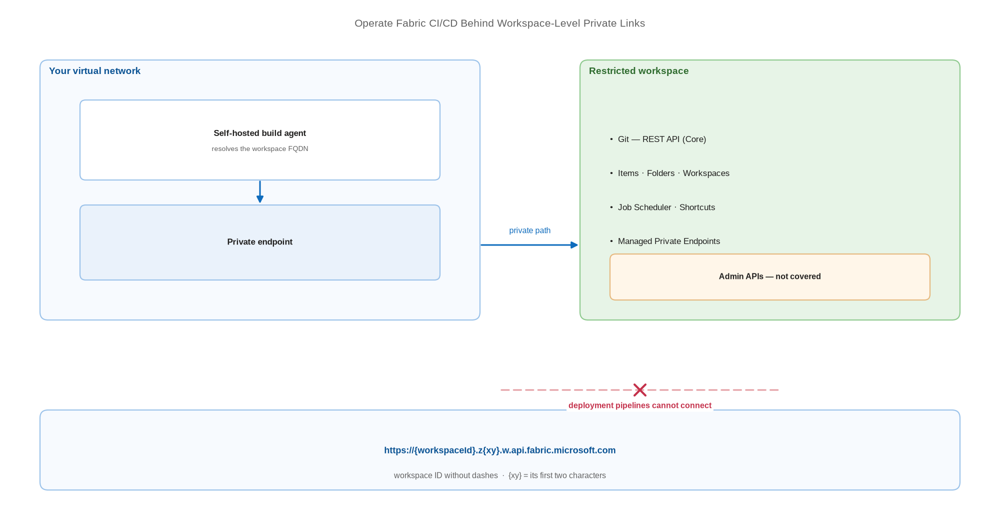

# Operate Fabric CI/CD Behind Workspace-Level Private Links

> What still works when public access is denied — and what stops working entirely.

*Series: Secured environment · Layer: Network (2 of 5) · Audience: Fabric admins, platform engineers, and analytics developers · Level 300*

Denying public inbound access to a workspace changes Fabric CI/CD materially: some APIs keep working over the private path, one major capability stops working altogether, and your build agent must resolve a workspace-specific FQDN it has never needed before. This entry is the map of what survives.

## Scenario — when to use this

Your security team requires that Fabric workspaces are unreachable from the public internet. You need to know, before you enable it, which parts of your CI/CD process will still function and which need redesigning.

Read this **before** restricting a workspace, not after. Several of the constraints below block enablement outright if the workspace holds the wrong item types.

For more detail on the supported scenarios, see:

- [Supported scenarios and limitations for workspace-level private links — Microsoft Learn](https://learn.microsoft.com/en-us/fabric/security/security-workspace-level-private-links-support)
- [Workspace-level private links overview — Microsoft Learn](https://learn.microsoft.com/en-us/fabric/security/security-workspace-level-private-links-overview)

## What you'll set up

- A clear understanding of which APIs work over workspace-level private links.
- The correct workspace FQDN format for your build agent.
- The `configure_fabric_fqdn` call in your deployment code.
- A promotion mechanism that does not depend on deployment pipelines.



*Figure 22 — Under workspace-level private links the Git and Core workspace APIs reach the workspace over the private endpoint; deployment pipelines cannot.*

## Prerequisites

- The workspace is on a **Fabric capacity (F SKU)** — workspace-level private links are F SKU only.
- A Fabric administrator has enabled the tenant setting **Configure workspace-level inbound network rules**.
- You are a workspace admin with the Azure rights to create private networking resources.
- The workspace contains **no Power BI semantic models** — they block enablement (see below).

## Step 1 — Check the blockers before you enable anything

| Blocker | Effect |
| --- | --- |
| Workspace assigned to a **deployment pipeline** | Inbound restriction is **blocked** for that workspace |
| Workspace contains **Power BI semantic models** | Workspace-level private links **cannot be enabled** |
| Workspace contains any **unsupported item type** | Inbound public access **cannot be restricted** |
| **Item sharing** in use | Not supported; existing shared links stop working |

> **Note** — The first row is the one that reshapes your architecture. **If any workspace in a deployment pipeline denies public access, deployment pipelines cannot connect to it** — and you cannot restrict a workspace that is already assigned to a pipeline. Deployment pipelines and workspace-level private links are mutually exclusive today.

## Step 2 — Know which APIs still work

Fabric Core APIs with endpoints containing `v1/workspaces/{workspaceId}` support workspace-level private links because they operate within the context of a specific workspace. These are supported over the private path:

- **Git — REST API (Core)** — the whole Layer 4 Git automation surface (entry 16).
- **Items**, **Folders**, and **Workspaces** APIs.
- **Job Scheduler**, **OneLake Data Access Security**, **OneLake Shortcuts**, **Tags**, **Managed Private Endpoints**.

Admin APIs use `admin/workspaces/{workspaceId}` and are **not** covered by workspace-level private links — they remain accessible, governed instead by the tenant-level setting for blocking public access.

> **Note** — One documented exception runs the other way: the **network communication policy API** remains accessible from public networks even when public access to the workspace is blocked. That is deliberate — it is how you unwind a misconfiguration that has locked you out.

## Step 3 — Get the FQDN format right

Your agent must resolve workspace-specific names, not the generic Fabric endpoints:

```
https://{workspaceId}.z{xy}.w.api.fabric.microsoft.com
https://{workspaceId}.z{xy}.c.fabric.microsoft.com
https://{workspaceId}.z{xy}.onelake.fabric.microsoft.com
https://{workspaceId}.z{xy}.dfs.fabric.microsoft.com
https://{workspaceId}.z{xy}.blob.fabric.microsoft.com

# {workspaceId} = the workspace ID WITHOUT dashes
# {xy}          = the FIRST TWO characters of the workspace ID

# Warehouse endpoints take a different shape:
https://{GUID}-{GUID}.z{xy}.datawarehouse.fabric.microsoft.com
```

> **Note** — If the FQDN is not formatted correctly it does not resolve to the intended private IP address and the workspace-level private link connection fails — usually with a generic connection error that gives no hint about the real cause.

## Step 4 — Configure your deployment tooling

`fabric-cicd` documents this exact failure and its fix. Call `configure_fabric_fqdn` **before** constructing the workspace object:

```
from fabric_cicd import configure_fabric_fqdn, FabricWorkspace

configure_fabric_fqdn(workspace_id)

workspace = FabricWorkspace(
    workspace_id=workspace_id,
    environment="PROD",
    repository_directory="./workspace",
    item_type_in_scope=["Notebook", "DataPipeline", "SemanticModel"],
    token_credential=credential,
)
```

The documented symptom is API calls failing with connection errors when deploying to a workspace with **Allow connections only from workspace level private links** enabled.

## Step 5 — Deny public access

1. In the Fabric portal, open the workspace → **Workspace settings** → **Inbound networking**.
2. Under **Workspace connection settings**, select **Allow connections from selected networks and workspace level private links**.
3. Select **Apply**.

> **Note** — The deny-public setting can take **up to 30 minutes** to take effect. Also note the portal cannot enable both inbound protection and outbound access protection on a workspace at the same time — use the **Workspaces — Set Network Communication Policy** API to configure both together.

## Secured environment — what changes

- Portal access follows the same rule as the APIs: a workspace denying inbound public access is reachable in the portal only from its associated private endpoint. From a public network or a different private endpoint the portal shows **Access Restricted**.
- Your build agent must sit inside the network that holds the private endpoint (entry 23) — hosted agents cannot reach it.
- The agent still needs **outbound** egress to `login.microsoftonline.com`, `aadcdn.msauth.net`, `msauth.net`, `msftauth.net`, `graph.microsoft.com`, and `login.live.com` for authentication, plus `https://pypi.org/*` to install tooling.
- At **tenant** level the two relevant settings are **Azure Private Links** and **Block Public Internet Access**. With both enabled, traffic targeting endpoints and scenarios that do not support private links is blocked by the service.
- On-premises data gateways are not supported and fail to register when Private Link is enabled, and the Fabric Capacity Metrics app does not support Private Link.

## Validate

- From inside the network, the workspace FQDN resolves to a **private** IP address.
- A Git API call from the agent succeeds against the restricted workspace.
- The same call from a public network fails — confirming the restriction is real.
- A `fabric-cicd` deployment with `configure_fabric_fqdn` succeeds; without it, it fails.
- The Fabric portal shows **Access Restricted** when opened from outside the private endpoint.

## Limitations & gotchas

- Workspace-level private links are **F SKU only** — not on P SKUs or trial capacities.
- Only **one** private link service per workspace; up to **100** private endpoints per workspace; up to **500** workspace private link services per tenant; up to **10** created per minute.
- At tenant level: private link is not supported on trial capacity, Fabric supports up to **450 capacities** in a private-link tenant, tenant migration is blocked while it is on, and a newly created capacity may take **up to 24 hours** before its endpoint appears in the private DNS zone.
- Item sharing is not supported; users with existing shared links lose access.
- Plan client connectivity — VPN, ExpressRoute, or a jump host — **before** denying public access, or administrators lose portal access too.

## Rollback

1. **Workspace settings** → **Inbound networking** → select **Allow connections from all networks** → **Apply**.
2. Allow up to 30 minutes for the change to propagate.
3. Remove the `configure_fabric_fqdn` call once no target workspace is restricted.
4. Delete the private endpoint and private link service in Azure if they are no longer needed.

## References

- [Supported scenarios and limitations for workspace-level private links — Microsoft Learn](https://learn.microsoft.com/en-us/fabric/security/security-workspace-level-private-links-support)
- [Workspace-level private links overview — Microsoft Learn](https://learn.microsoft.com/en-us/fabric/security/security-workspace-level-private-links-overview)
- [Set up and use workspace-level private links — Microsoft Learn](https://learn.microsoft.com/en-us/fabric/security/security-workspace-level-private-links-set-up)
- [Private links for Fabric tenants — Microsoft Learn](https://learn.microsoft.com/en-us/fabric/security/security-private-links-overview)
- [fabric-cicd — troubleshooting](https://microsoft.github.io/fabric-cicd/latest/how_to/troubleshooting/)
- [Security considerations for Fabric CI/CD — Microsoft Learn](https://learn.microsoft.com/en-us/fabric/cicd/cicd-security)
