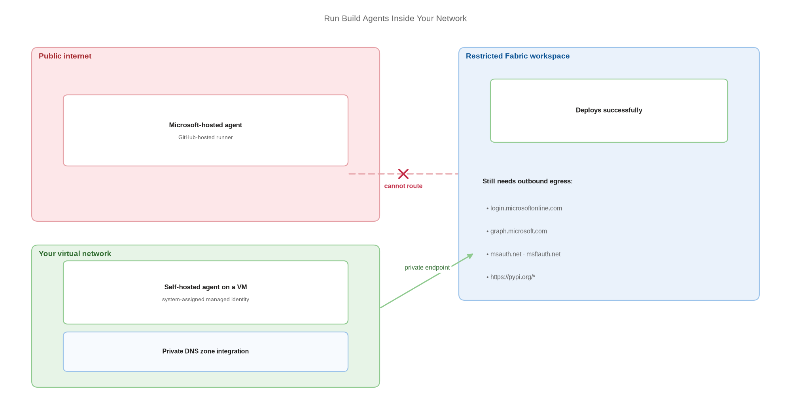

# Run Build Agents Inside Your Network

> Put the deployment runner where the private endpoint is, because hosted agents cannot reach it.

*Series: Secured environment · Layer: Network (3 of 5) · Audience: Fabric admins, platform engineers, and analytics developers · Level 300*

A Microsoft-hosted agent or a GitHub-hosted runner lives on the public internet. If your Fabric workspaces deny public access, no hosted runner can deploy to them — the agent has to move inside your network. This entry places it there.

## Scenario — when to use this

You have restricted workspace inbound access (entry 22) and your pipeline now fails with connection errors. The pipeline configuration is correct; the runner simply cannot route to a private endpoint.

You also need this when your Git provider is reachable only from inside the network, or when compliance requires that build machines sit within a controlled boundary.

For more detail on the agent options, see:

- [Azure Pipelines agents — Microsoft Learn](https://learn.microsoft.com/en-us/azure/devops/pipelines/agents/agents)
- [Self-hosted runners — GitHub Docs](https://docs.github.com/en/actions/hosting-your-own-runners/managing-self-hosted-runners/about-self-hosted-runners)

## What you'll set up

- A self-hosted agent or runner on a VM inside the VNet holding the private endpoint.
- DNS resolution for the workspace private-link FQDNs from that VM.
- A managed identity on the VM so the agent authenticates without a secret.
- Controlled outbound egress for authentication and package installation.



*Figure 23 — A self-hosted agent inside the virtual network reaches the workspace private endpoint; a hosted agent on the public internet cannot.*

## Prerequisites

- A virtual network containing the workspace private endpoint (entry 22).
- A VM in that VNet, or subnet-joined compute, to host the agent.
- Private DNS zone integration so the workspace FQDNs resolve to private IPs.
- Permission to register an agent in Azure DevOps or a runner in GitHub.

## Step 1 — Place the agent

1. Create a VM in the VNet — or a subnet peered to it — that can reach the private endpoint.
2. Confirm the VM resolves the workspace FQDN to a **private** IP before installing anything (entry 22).
3. Size it for your build: `fabric-cicd` deployments are network-bound rather than compute-heavy, so a modest VM is usually sufficient.
4. Harden it as a production machine. It holds deployment rights to your Fabric estate.

## Step 2 — Install the agent or runner

For **Azure DevOps**, install a self-hosted agent and register it into an agent pool dedicated to Fabric deployments. For **GitHub**, add a self-hosted runner scoped to the repository or organisation and give it a label your workflow targets.

```
# Azure Pipelines - target the pool in YAML
pool:
  name: fabric-private-pool

# GitHub Actions - target the runner by label
jobs:
  deploy:
    runs-on: [ self-hosted, linux, fabric-private ]
```

## Step 3 — Give the VM a managed identity

1. Enable a **system-assigned managed identity** on the VM.
2. Add that identity to the security group holding your Fabric automation principals (entry 21).
3. Grant the group the workspace roles it needs.
4. In deployment code, use `ManagedIdentityCredential` — documented for Azure DevOps self-hosted agents with a system-assigned managed identity, and for agents hosted on Azure VMs with managed identity.

```
from azure.identity import ManagedIdentityCredential
credential = ManagedIdentityCredential()

# Fabric CLI equivalent
#   fab auth login --identity                 # system-assigned
#   fab auth login --identity -u <client_id>  # user-assigned
```

> **Tip** — This is the strongest available posture: the agent is inside the network, and it holds no credential at all. There is no secret to rotate, leak, or find in a log.

## Step 4 — Open only the egress you need

A locked-down agent still needs outbound access to authenticate and to install tooling. Microsoft documents these as required from the client in a Private Link environment:

```
# Authentication
login.microsoftonline.com
aadcdn.msauth.net
msauth.net
msftauth.net
graph.microsoft.com
login.live.com

# Tooling installation
https://pypi.org/*          # pip install fabric-cicd / ms-fabric-cli

# Additional, for Data Engineering scenarios
http://res.cdn.office.net/
https://aznbcdn.notebooks.azure.net/
https://cdn.jsdelivr.net/npm/monaco-editor*
```

> **Tip** — Where PyPI egress is not permitted, pre-bake `fabric-cicd` and `ms-fabric-cli` into a container image or an internal package mirror and pin the versions. That removes the egress requirement and makes builds reproducible at the same time.

## Secured environment — what changes

- The agent VM is now part of your Fabric trust boundary. Patch it, restrict sign-in to it, and audit access to it as you would a production server.
- Use a **dedicated agent pool** for Fabric deployments and restrict which pipelines may use it. A shared pool means any pipeline in the project inherits your Fabric deployment reach.
- Do not allow interactive sign-in to the agent VM for routine work — an operator on that machine inherits the managed identity's Fabric access.
- Keep the agent in the same region as the capacity where possible, to avoid cross-region routing surprises.
- Trusted workspace access for storage requires resource instance rules created through **ARM templates or PowerShell** — the Azure portal UI is not supported for Fabric workspace rules (entry 15).

## Validate

- From the agent VM, the workspace FQDN resolves to a private IP.
- A deployment from the self-hosted agent succeeds against the restricted workspace.
- The same pipeline on a hosted agent fails — confirming the private path is what makes it work.
- The agent authenticates with no secret present in the pipeline definition.
- Only the intended pipelines can queue against the agent pool.

## Limitations & gotchas

- Self-hosted agents are yours to maintain — patching, disk, and runtime versions are your responsibility.
- Managed identity sign-in for the Fabric CLI is currently tested and validated only on **Azure Virtual Machine** resources.
- DNS is the usual failure point. A VM that resolves the public IP will fail with an opaque connection error rather than a routing error.
- One agent is a single point of failure; run at least two in the pool for anything production-facing.
- GitHub-hosted and Microsoft-hosted runners cannot be placed inside your VNet — there is no configuration that makes this work.

## Rollback

1. Point the pipeline back at a hosted pool or `ubuntu-latest` and re-run.
2. This only succeeds if the target workspaces permit public access — otherwise restore the self-hosted pool.
3. Deregister the agent from the pool and decommission the VM once nothing targets it.

## References

- [Azure Pipelines agents — Microsoft Learn](https://learn.microsoft.com/en-us/azure/devops/pipelines/agents/agents)
- [Self-hosted Linux agents — Microsoft Learn](https://learn.microsoft.com/en-us/azure/devops/pipelines/agents/linux-agent)
- [Self-hosted runners — GitHub Docs](https://docs.github.com/en/actions/hosting-your-own-runners/managing-self-hosted-runners/about-self-hosted-runners)
- [Workspace-level private links overview — Microsoft Learn](https://learn.microsoft.com/en-us/fabric/security/security-workspace-level-private-links-overview)
- [fabric-cicd — authentication](https://microsoft.github.io/fabric-cicd/latest/example/authentication/)
- [Private links for Fabric tenants — Microsoft Learn](https://learn.microsoft.com/en-us/fabric/security/security-private-links-overview)
