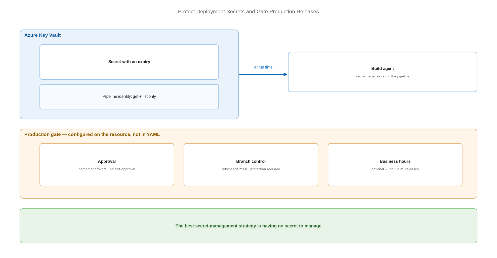

# Protect Deployment Secrets and Gate Production Releases

> Keep credentials in a vault, and make production wait for a human.

*Series: Secured environment · Layer: Controls (4 of 5) · Audience: Fabric admins, platform engineers, and analytics developers · Level 300*

Two controls separate a scripted deployment from a governed one: secrets that live in a vault rather than a pipeline variable, and a production stage that cannot proceed without an approval. Both are cheap to add and both are what an auditor asks about first.

## Scenario — when to use this

Your pipeline works but a client secret is stored in its variables, and any merge to `main` can reach production without a human decision. You need credential hygiene and a release gate.

Add both before the pipeline first deploys to production. Retrofitting an approval after an unreviewed release has already happened is a conversation nobody enjoys.

For more detail on the mechanisms, see:

- [About Azure Key Vault — Microsoft Learn](https://learn.microsoft.com/en-us/azure/key-vault/general/overview)
- [Define approvals and checks — Microsoft Learn](https://learn.microsoft.com/en-us/azure/devops/pipelines/process/approvals)

## What you'll set up

- Azure Key Vault holding any secret that must exist.
- Pipeline access to the vault through a managed identity or service connection.
- An approval check on the production environment.
- A branch control check so only approved branches can deploy.



*Figure 24 — Secrets resolve from Key Vault at run time; the production stage pauses for approval and branch control before deploying.*

## Prerequisites

- A working release pipeline (entries 19-20).
- An Azure subscription in which to create a key vault.
- Permission to create environments and approval checks.
- A defined approver group — ideally not the same people who author the content.

## Step 1 — Prefer no secret at all

Before building secret management, remove the secret. In order of preference:

1. **Workload identity federation** — `WorkloadIdentityCredential`, no secret exists (entry 21).
2. **Managed identity** on a self-hosted agent — `ManagedIdentityCredential`, no secret exists (entry 23).
3. **Certificate** credential — a secret exists but is harder to exfiltrate and easier to scope.
4. **Client secret in Key Vault** — the fallback, not the default.

> **Tip** — The best secret-management strategy is having nothing to manage. Options 1 and 2 cover the large majority of Fabric CI/CD scenarios; reach for a vault only for the remainder.

## Step 2 — Store what remains in Key Vault

1. Create a key vault dedicated to deployment secrets.
2. Add the secret — a client secret, a Git personal access token, or a data-source credential.
3. Grant the pipeline identity **get** and **list** on secrets, and nothing more.
4. Set an expiry on every secret so rotation is enforced rather than remembered.

## Step 3 — Consume the secret at run time

In Azure Pipelines, link the vault so secrets resolve into variables at run time rather than being stored in the pipeline:

```
variables:
- group: fabric-deploy-secrets     # backed by Azure Key Vault

steps:
- task: AzureKeyVault@2
  inputs:
    azureSubscription: 'fabric-deploy-connection'
    KeyVaultName: 'kv-fabric-deploy'
    SecretsFilter: 'fabric-client-secret'
    RunAsPreJob: true

- script: python deploy.py
  env:
    AZURE_CLIENT_SECRET: $(fabric-client-secret)
```

> **Note** — Never echo a secret to the build log, and never pass one on a command line where it appears in process listings. Pass secrets through environment variables, as above.

## Step 4 — Gate production with an approval

1. Go to **Pipelines** → **Environments** and open your production environment.
2. Select **Approvals and checks** → **+** → **Approvals** → **Next**.
3. Add approvers, restrict them from approving their own runs, and set a **Timeout**.
4. Select **Create**.

In GitHub, the equivalent is **Required reviewers** on the production environment (entry 20).

> **Note** — Approvals are configured on **resources** — environments, service connections, repositories, variable groups, secure files, and agent pools — and are **not** defined in the YAML file. Users who can edit the pipeline YAML cannot modify the checks, which is exactly why the control holds.

## Step 5 — Add a branch control check

1. On the same environment, add a **Branch control** check.
2. Supply a comma-separated list of allowed branches, fully qualified as `refs/heads/main`.
3. Require that the branch has protection enabled.
4. Define the behaviour when protection status is unknown — fail closed.

> **Tip** — Approvals and branch control answer different questions. An approval asks *should we release now?*; branch control asks *is this content from a reviewed branch?*. You want both — an approver cannot reasonably verify provenance by eye.

## Secured environment — what changes

- Enable secret scanning and push protection on the repository so a committed credential is blocked at push time rather than found in an audit.
- A **variable library is not a secret store** — it holds configuration. Keep credentials in the vault and reference connections instead (entry 11).
- Grant **bypass** permissions to as few identities as possible. A bypass on the production environment silently removes the control you just built.
- Where separation of duties is required, the approver group must not overlap with the author group. In regulated settings this is frequently an explicit control objective rather than a preference.
- Consider a **business hours** check so production deployments cannot land at 3 a.m. when nobody is available to respond.

## Validate

- The pipeline retrieves the secret at run time and the value never appears in logs.
- A production run **pauses** and names the pending approvers.
- An approver outside the group cannot approve.
- A run from a non-allowed branch is blocked by branch control.
- Removing the pipeline identity's vault access breaks the run — confirming the vault is the real source.

## Limitations & gotchas

- The approver list is **fixed when checks start running** — adding approvers mid-run has no effect.
- If a **group** is an approver, only one member needs to approve.
- If approvals are not completed within the timeout, the stage is marked **skipped**, not failed — make sure your reporting distinguishes them.
- Branch names in branch control must be fully qualified (`refs/heads/<branch>`).
- Checks can be **bypassed** by anyone holding administrator permission on the resource — audit who that is.
- A single final negative decision denies the stage; most check decisions are final and cannot be retried.

## Rollback

1. To relax a gate temporarily, **disable** the check rather than deleting it, so it can be re-enabled unchanged.
2. To revert to pipeline-stored variables, remove the vault task and re-add the variable — then rotate the secret, because it has now existed in two places.
3. Remove the branch control check to allow deployment from additional branches.

## References

- [About Azure Key Vault — Microsoft Learn](https://learn.microsoft.com/en-us/azure/key-vault/general/overview)
- [Query and use Azure Key Vault secrets in your pipeline — Microsoft Learn](https://learn.microsoft.com/en-us/azure/devops/pipelines/release/key-vault-in-own-project)
- [Define approvals and checks — Microsoft Learn](https://learn.microsoft.com/en-us/azure/devops/pipelines/process/approvals)
- [Create and target Azure DevOps environments for pipelines — Microsoft Learn](https://learn.microsoft.com/en-us/azure/devops/pipelines/process/environments)
- [Managing environments for deployment — GitHub Docs](https://docs.github.com/en/actions/deployment/targeting-different-environments/using-environments-for-deployment)
- [Security considerations for Fabric CI/CD — Microsoft Learn](https://learn.microsoft.com/en-us/fabric/cicd/cicd-security)
