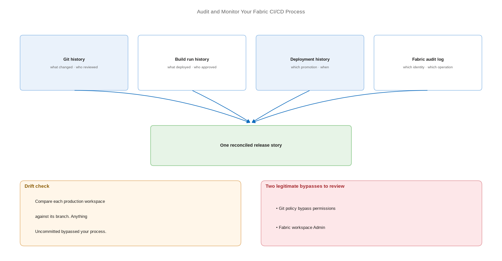

# Audit and Monitor Your Fabric CI/CD Process

> Prove who changed what, when — and detect the changes that bypassed your process.

*Series: Secured environment · Layer: Assurance (5 of 5) · Audience: Fabric admins, platform engineers, and analytics developers · Level 300*

The capstone. Everything in this series creates a controlled path from a developer's workspace to production. This entry establishes how you prove the path was followed — and how you detect the changes that went around it.

## Scenario — when to use this

You are asked to demonstrate that production analytics content is change-controlled: who deployed, when, what was in the release, and who approved it. Or a report changed unexpectedly and you need to establish whether it came through the pipeline at all.

Set this up once the pipeline is running. Audit evidence is only useful if it was being collected before the question was asked.

For more detail on the sources, see:

- [Track user activities in Fabric — Microsoft Learn](https://learn.microsoft.com/en-us/fabric/admin/track-user-activities)
- [Use the monitoring hub to track Fabric activity — Microsoft Learn](https://learn.microsoft.com/en-us/fabric/admin/monitoring-hub)

## What you'll set up

- Access to the Fabric audit log for CI/CD-relevant operations.
- A monitoring routine covering deployment history and Git history.
- A detection method for changes made directly in production.
- A retention position that matches your compliance obligation.

*Figure 25 — Four evidence sources: Git history, deployment history, the Fabric audit log, and the build system record — reconciled into one release story.*

## Prerequisites

- The **Audit Logs** role in Exchange Online. By default the **Compliance Management** and **Organization Management** role groups hold the necessary roles.
- Access to the Microsoft Purview portal.
- Access to your Git provider's history and your build system's run history.
- A working release process to audit (entries 19-20).

## Step 1 — Reach the audit log

1. Go to the **Microsoft Purview portal** to access the audit logs.
2. Search using the Purview filters. Combining filters returns only results matching **all** criteria.
3. Set the **Start date** and **End date** — the default is the past seven days, and times are displayed in **UTC**.
4. Filter by **Activities** to target specific operations, and by **Users** to scope to an identity such as your deployment service principal.
5. For repeatable extraction, connect to Exchange Online PowerShell and query the log from there.

> **Tip** — Filter by your CI/CD service principal (entry 21) to get a clean list of every automated deployment. Anything touching production content that is **not** in that list came from outside your process — which is exactly the exception report you want.

## Step 2 — Reconcile the four evidence sources

| Source | What it proves | Where to find it |
| --- | --- | --- |
| **Git history** | What changed, who wrote it, who reviewed and approved the merge | Git provider |
| **Build run history** | What was deployed, from which commit, who approved the release | Azure DevOps / GitHub Actions |
| **Deployment history** | Which stage promotion ran, when, and the note attached | Deployment pipeline (entry 12) |
| **Fabric audit log** | Which identity performed which operation in the tenant | Microsoft Purview portal |

A complete release story links all four: a reviewed commit, a build that consumed it, an approval, and audit entries attributed to the deployment identity. A gap in any one of them is the finding.

## Step 3 — Detect changes that bypassed the process

1. In each production workspace, use the **Source control** panel or the Git **Get Status** API (entry 16) to compare the workspace against its branch.
2. Any item reported as **Uncommitted** in production changed outside your process.
3. Where you use deployment pipelines, run the stage comparison — items marked **Different** that you did not deploy are direct edits.
4. Schedule this as a recurring check and alert on any non-empty result.

> **Tip** — This drift check is the highest-value monitoring you can add. A production workspace should always be identical to its branch; the moment it is not, either someone edited production directly or a deployment failed partway. Both warrant investigation.

## Step 4 — Monitor operational health

1. Use the **monitoring hub** to track activity across Fabric items — job runs, refreshes, and failures.
2. Alert on deployment failures from your build system rather than relying on someone reading the run list.
3. Track the elapsed time between merge and production deployment; a lengthening gap usually means the process is being worked around.
4. Review who holds workspace **Admin** and who holds pipeline **bypass** permissions on a schedule.

## Secured environment — what changes

- Capacity ID and capacity name are **not always available** in the audit log. Where they are missing, the Microsoft Fabric Capacity Metrics app carries them — though note that app does not support Private Link (entry 22).
- Workspace identity operations are audited under their own operation names — creation, retrieval, deletion, and token retrieval for a workspace identity.
- Export audit evidence into your SIEM on a schedule. The default search window is seven days, which is shorter than most retention obligations.
- Make the drift check in Step 3 a **control**, not a report. In a regulated environment, "production matches its branch" is an assertion you should be able to evidence continuously.
- Review the two legitimate ways your controls are circumvented — Git policy bypass permissions and Fabric workspace Admin — as part of every access review.

## Validate

- A deployment you performed appears in the audit log attributed to the deployment identity.
- You can trace a production item back through deployment history, build run, approval, and merge commit.
- A deliberate direct edit in a non-production workspace is detected by the drift check.
- Audit data is reaching your long-term store, not only the seven-day search window.

## Limitations & gotchas

- Audit log access needs an Exchange Online role, so it usually sits with a different team than Fabric administration — arrange access before you need it.
- Audit times are displayed in **UTC**; reconcile carefully against local build timestamps.
- The default search range is the past seven days and the maximum supported range is governed by Purview, not Fabric.
- Deployment pipeline history is per pipeline — there is no single tenant-wide deployment view.
- Git history proves what was **merged**, not what was **deployed**. Only the build run links the two.

## Rollback

1. Monitoring is additive — there is nothing to undo operationally.
2. To stop an export, disable the scheduled job that writes into your SIEM.
3. Retain historical audit evidence even after retiring a solution; the obligation usually outlives the workload.

## References

- [Track user activities in Fabric — Microsoft Learn](https://learn.microsoft.com/en-us/fabric/admin/track-user-activities)
- [Use the monitoring hub to track Fabric activity — Microsoft Learn](https://learn.microsoft.com/en-us/fabric/admin/monitoring-hub)
- [Security considerations for Fabric CI/CD — Microsoft Learn](https://learn.microsoft.com/en-us/fabric/cicd/cicd-security)
- [Microsoft Fabric admin overview — Microsoft Learn](https://learn.microsoft.com/en-us/fabric/admin/admin-overview)
- [Troubleshoot CI/CD in Fabric — Microsoft Learn](https://learn.microsoft.com/en-us/fabric/cicd/troubleshoot-cicd)
- [Fabric CI/CD best practices — Microsoft Learn](https://learn.microsoft.com/en-us/fabric/cicd/best-practices-cicd)
